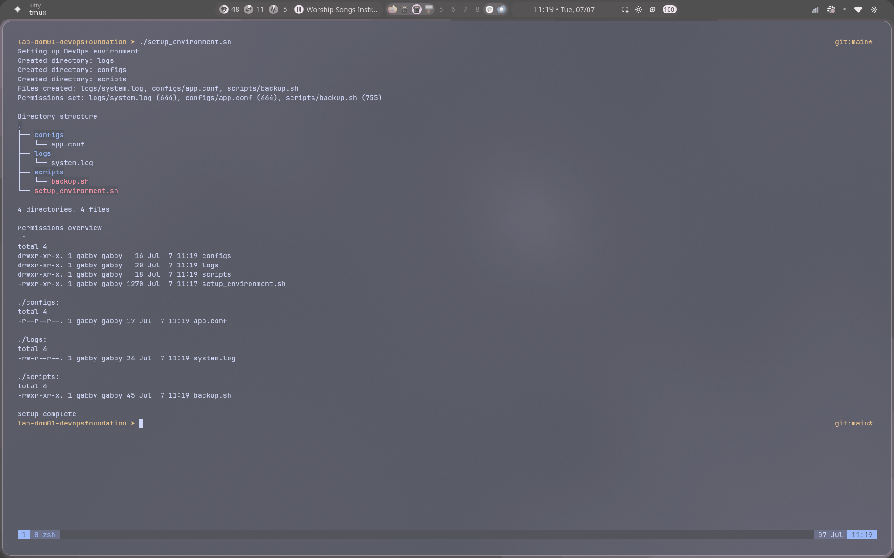

# SysAdmin starter pack

A Bash scripting exercise that automates creation of a standard project
folder structure, populates it with sample files, and locks down
permissions on each.

## What it does

Running `setup_environment.sh`:

1. Creates three directories: `logs/`, `configs/`, `scripts/` (skipping any
   that already exist).
2. Writes sample content into `logs/system.log` and `configs/app.conf`, and
   generates a placeholder `scripts/backup.sh`.
3. Sets distinct permissions on each file:
   - `logs/system.log` → `644` (owner read/write, others read-only)
   - `configs/app.conf` → `444` (read-only for everyone, including the owner)
   - `scripts/backup.sh` → `755` (executable)
4. Prints the resulting directory tree and a full permissions listing
   (`ls -lR`).

The script runs with `set -e`, so it stops immediately if any command
fails rather than continuing in a half-finished state.

## Usage

```bash
./setup_environment.sh
```

## Project structure

```
setup_environment.sh   Main automation script
logs/system.log        Sample log file (644)
configs/app.conf        Sample config file (444, read-only)
scripts/backup.sh       Placeholder backup script (755, executable)
screenshots/            Captured output from running the script
```

## Example output



## Note on re-running

`configs/app.conf` is left read-only (`444`) after the first run. Running
the script again will fail at the `echo ... > configs/app.conf` step with
`Permission denied`, since the file can no longer be overwritten by its
owner. Restore write access first if you need to re-run the script:

```bash
chmod 644 configs/app.conf
./setup_environment.sh
```
