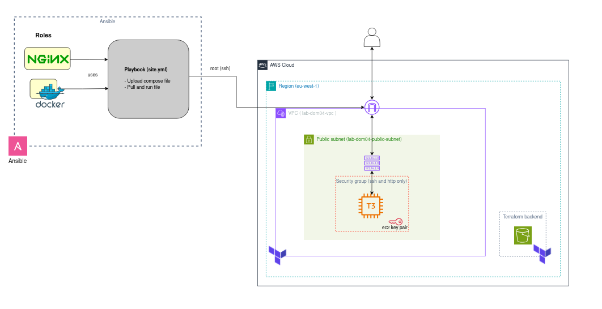
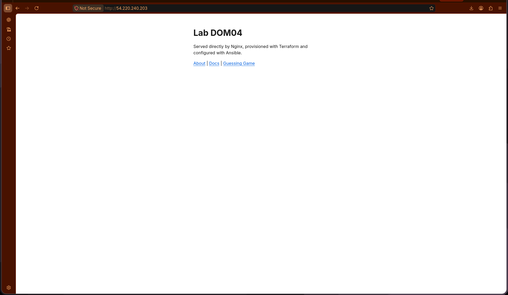
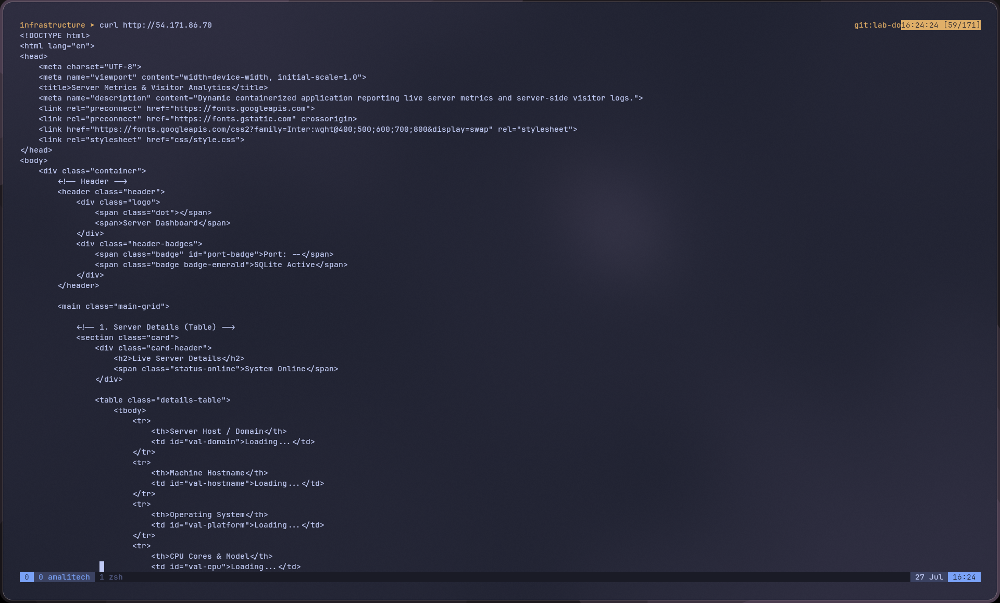

# Lab DOM04 - Advanced IaC

Provisions AWS networking and a public EC2 instance with Terraform, then uses Ansible to configure it: installs nginx as a reverse proxy and Docker (with the Compose v2 CLI plugin) to run a small containerized app behind it.

## Architecture



Two halves, split by the dashed boxes in the diagram:

- **Ansible (control side):** the `nginx` and `docker` roles feed into the `site.yml` playbook, which connects over SSH as `root` and does two things on the target: uploads the Compose file, then pulls and runs it.
- **AWS (eu-west-1):** a VPC (`lab-dom04-vpc`) containing one public subnet (`lab-dom04-public-subnet`), a security group scoped to SSH and HTTP only, and a single `t3.micro` EC2 instance reachable via its EC2 key pair. A user reaches the instance from outside through the same public path Ansible uses to connect.

The Terraform backend (S3) is shown as a separate box outside the VPC, since it's not part of this lab's own resources: it's the same shared bucket (`terraform-backend-eu-west-1-55zz0s`, key `lab-dom03/statefile`) used by `lab-dom03-IACWithTerraform`, configured in `infrastructure/providers.tf`.

What the diagram doesn't show at the resource level (nginx reverse-proxying to the app container on port 3000, the roles' internal task flow) is covered in the roles' own READMEs and in `configuration/site.yml`.

---

## Project structure

```
lab-dom04-AdvancedIAC/
├── infrastructure/
│   ├── providers.tf       Terraform block, required providers, S3 backend, AWS provider
│   ├── main.tf            VPC, subnet, IGW, route table, security group + rules, key pair, EC2 instance
│   ├── variable.tf        Input variables
│   ├── outputs.tf         IDs, public IP/DNS, SSH user, key pair name/path
│   └── terraform.tfvars   Your SSH CIDR (gitignored, not committed)
├── configuration/
│   ├── ansible.cfg         Disables SSH host key checking (this lab's EC2 host gets a new IP/key every apply)
│   ├── site.yml            Playbook: applies nginx + docker roles, deploys the app via Compose
│   ├── inventory/
│   │   └── inventory.ini   Single-host inventory (EC2 public IP, ec2-user, private key path)
│   ├── templates/
│   │   └── nginx.conf.j2   Reverse proxy server block, owned by the playbook (not the role)
│   ├── site/
│   │   └── compose.yml     Docker Compose file for the app container
│   └── roles/
│       ├── nginx/          See roles/nginx/README.md
│       └── docker/         See roles/docker/README.md
├── screenshots/            Proof: app served through nginx, in-browser and via curl
├── lab-dom04-architecturediagram.png
├── APPLY.txt               terraform apply output
├── ansible-play.txt        ansible-playbook run output
└── DESTROY.txt             terraform destroy output
```

---

## Prerequisites

| Requirement | Notes |
|---|---|
| Terraform `~> 1.15.8` | Verify with `terraform version` |
| AWS credentials | `aws configure` or env vars |
| Ansible (`ansible` package, not just `ansible-core`) | Needed for the bundled `community.docker` collection; verify with `ansible-galaxy collection list community.docker` |
| Remote backend already bootstrapped | Same S3 bucket used by `lab-dom03-IACWithTerraform` |

---

## Usage

### 1. Provision infrastructure

```bash
cd infrastructure
echo "ssh_allowed_cidr = \"$(curl -s https://checkip.amazonaws.com)/32\"" > terraform.tfvars
terraform init
terraform plan
terraform apply -no-color | tee ../APPLY.txt
```

`-no-color` avoids littering the log file with raw ANSI escape codes. This creates the VPC/subnet/networking, generates an SSH key pair (private key written locally via `local_sensitive_file`), and launches the EC2 instance.

### 2. Update the inventory

Terraform assigns a new public IP each time the instance is recreated. Update `configuration/inventory/inventory.ini` with the current `instance_public_ip` from `terraform output`:

```
[lab_dom04]
<instance_public_ip> ansible_user=ec2-user ansible_ssh_private_key_file="../infrastructure/lab-dom04-private-key.pem"
```

### 3. Run the playbook

```bash
cd ../configuration
ansible-playbook -i inventory site.yml | tee ../ansible-play.txt
```

This installs nginx and Docker (roles), deploys `nginx.conf.j2` as the reverse proxy config, validates the full nginx config before reloading, and starts the app container via `docker compose`. `ansible.cfg` disables host key checking in this directory, since the host's IP and SSH key change every time the instance is recreated, there's no long-lived trust to protect on a disposable lab box, and the alternative (`ssh-keyscan` before every run) is friction with no real payoff here.

### 4. Verify

Open the instance's public IP in a browser: nginx should be proxying to the app on port 3000.



Confirmed from the command line too:



```bash
ssh -i infrastructure/lab-dom04-private-key.pem ec2-user@<instance_public_ip>
```

### 5. Destroy

```bash
cd infrastructure
terraform destroy -no-color | tee ../DESTROY.txt
```

Run this interactively (not with `-auto-approve`), so you still get Terraform's own "yes" confirmation before it tears down real resources.

---

## Variables reference

| Variable | Default | Description |
|---|---|---|
| `region` | `eu-west-1` | AWS region |
| `vpc_cidr_block` | `10.0.0.0/16` | CIDR for the VPC |
| `vpc_name` | `lab-dom04-vpc` | Name tag for the VPC |
| `subnet_cidr_block` | `10.0.1.0/24` | CIDR for the public subnet |
| `subnet_name` | `lab-dom04-public-subnet` | Name tag for the subnet |
| `igw_name` | `lab-dom04-igw` | Name tag for the Internet Gateway |
| `rt_name` | `lab-dom04-rt` | Name tag for the route table |
| `rt_association_ipv4_igw_cidr_block` | `0.0.0.0/0` | IPv4 default route CIDR |
| `rt_association_ipv6_igw_cidr_block` | `::/0` | IPv6 default route CIDR |
| `sg_name` | `allow_tls_ssh` | Name tag for the security group |
| `ssh_allowed_cidr` | *(required, no default)* | CIDR allowed to SSH on port 22, set via `terraform.tfvars` |
| `http_allowed_cidr` | `0.0.0.0/0` | CIDR allowed on port 80, and reused for the all-outbound egress rule |
| `private_key_pair_name` | `lab-dom04-private-key.pem` | Local filename for the generated private key |
| `key_pair_name` | `lab-dom04-public-key.pem` | Name registered for the AWS key pair |
| `instance_type` | `t3.micro` | EC2 instance type |
| `instance_name` | `lab-dom04-web` | Name tag for the EC2 instance |

---

## Outputs reference

| Output | Description |
|---|---|
| `vpc_id` | ID of the created VPC |
| `public_subnet_id` | ID of the public subnet |
| `security_group_id` | ID of the security group |
| `instance_id` | ID of the EC2 instance |
| `instance_public_ip` | Public IP of the EC2 instance |
| `instance_public_dns` | Public DNS name of the EC2 instance |
| `ssh_user` | SSH user for the instance (`ec2-user`, Amazon Linux default) |
| `key_pair_name` | Name of the AWS key pair associated with the instance |
| `private_key_path` | Local path to the generated private key file |

---

## Ansible configuration notes

- `nginx_template` and `nginx_site_conf_path` are owned entirely by `site.yml`, not by the `nginx` role. See `roles/nginx/README.md` for why (it comes down to `include_vars` outranking playbook `vars:` in Ansible's precedence order).
- Both roles currently only have a verified `vars/RedHat.yml` (Amazon Linux 2023); Debian/Ubuntu support was removed. See each role's own README for details and variable references.
- Docker Compose v2 is installed as a manually-downloaded CLI plugin, not via package, since the distro-native `docker` package doesn't bundle it. See `roles/docker/README.md`.
