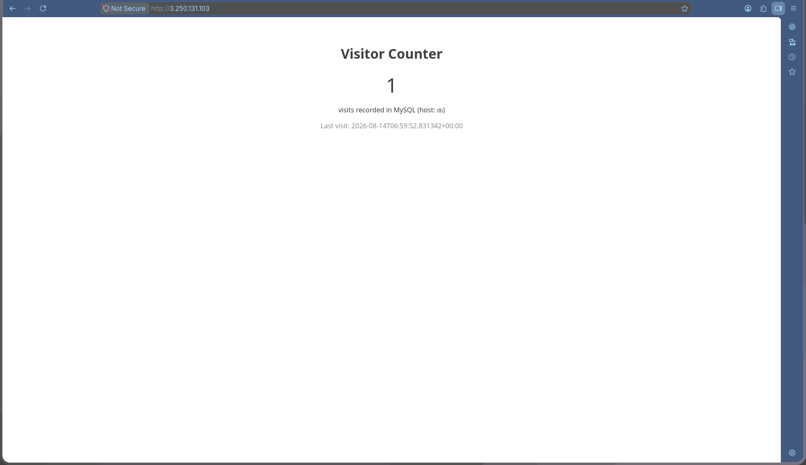
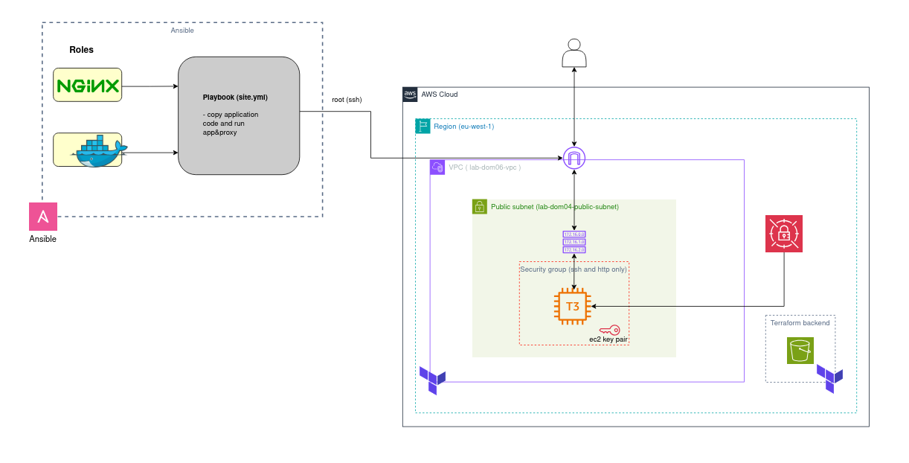

# multi-container-app

A two-tier Flask + MySQL app, deployed with Docker Compose behind nginx, on an EC2 instance provisioned by Terraform and configured by Ansible.

**Live evidence:** `http://3.250.131.103/` - visitor counter, incrementing on each request, backed by MySQL.



## Architecture



Terraform provisions the VPC, public subnet, security group, EC2 instance, and Secrets Manager secret (state in an S3 backend). Ansible then connects over SSH as root and runs `site.yml`, which applies the `nginx` and `docker` roles and deploys the app.

On the instance itself: nginx (host package) reverse-proxies port 80 to `web`, which is bound to `127.0.0.1:5000` only - not reachable from outside the instance directly. `web` talks to `db` (MySQL 8) over the Docker Compose network; `db` isn't exposed to the host at all. `web` fetches its DB password from Secrets Manager via the instance's IAM role - no credentials stored on disk.

## Structure

```
multi-container-app/
├── docker-compose.yml       Services: web, db
├── .env / .env.example      Non-secret config + dev-default password fallback
├── web/
│   ├── app.py                Flask app - visitor counter, /health endpoint
│   ├── requirements.txt      Flask, PyMySQL, cryptography, boto3
│   └── Dockerfile            python:3.9-slim, non-root user
├── db/
│   └── init.sql              Creates the visits table
├── infrastructure/           Terraform: VPC, subnet, SG, EC2, Secrets Manager, IAM
├── configuration/            Ansible: installs Docker + nginx, deploys the app
│   ├── site.yml
│   ├── inventory/aws_ec2.yml     Dynamic inventory (amazon.aws.aws_ec2)
│   ├── roles/docker/             Installs Docker Engine + Compose v2 plugin
│   ├── roles/nginx/              Installs nginx, deploys the reverse-proxy config
│   └── templates/
│       ├── nginx-reverse-proxy.conf.j2
│       └── env.j2                Renders .env on the instance from the real secret
└── screenshots/
```

## How secrets work

Only the DB password is treated as a secret - `MYSQL_DATABASE`, `MYSQL_USER`, `MYSQL_HOST` etc. are plain config in `.env`.

- **Locally:** `MYSQL_PASSWORD` in `.env` (a dev-default placeholder, gitignored - see `.env.example`).
- **On EC2:** `web/app.py` fetches the password live from AWS Secrets Manager via `boto3`, using the instance's IAM role - no credentials on disk, no `aws configure`. Cached for 5 minutes so a rotated secret is picked up without restarting the container.
- **`db` (stock `mysql:8.0` image)** has no AWS awareness, so it still needs the password as a literal env var. The Ansible playbook fetches the same Secrets Manager secret via the instance's IAM role and renders it into `.env` on the instance (`templates/env.j2`) - `web` and `db` end up with matching credentials, via two different paths appropriate to what each is.

## Local usage

```bash
cp .env.example .env   # edit if you want different dev credentials
docker compose up -d --build
curl http://localhost:5000
docker compose down --volumes
```

## EC2 deployment

```bash
# 1. Provision infrastructure
cd infrastructure
terraform init
terraform apply

# 2. Deploy the app
cd ../configuration
ansible-playbook -i inventory/aws_ec2.yml site.yml

# 3. Verify
curl http://<instance_public_ip>/

# 4. Tear down
cd ../infrastructure
terraform destroy
```

`ssh_allowed_cidr` must be set in `infrastructure/terraform.tfvars` before applying.

## Notes / deviations from the original brief

- **Amazon Linux 2023, not Amazon Linux 2** - AL2023 is AL2's supported successor; the AMI lookup (`infrastructure/main.tf`) targets it explicitly.
- **EC2 instance type is `t3.micro`**, not `t2.micro` - this AWS account's org-level SCP (`LimitEC2InstanceTypes`) denies `t2.*` outright.
- **Public access is on port 80 via nginx, not port 5000 directly** - `web` only binds `127.0.0.1:5000` on the instance; nginx is the sole public entry point. `curl http://localhost:5000` still works exactly as specified when run on the instance itself (or with local `docker compose up`, per "Local usage" above) - it's only the public-internet-facing story that moved to port 80, as an intentional hardening step beyond the original brief.
