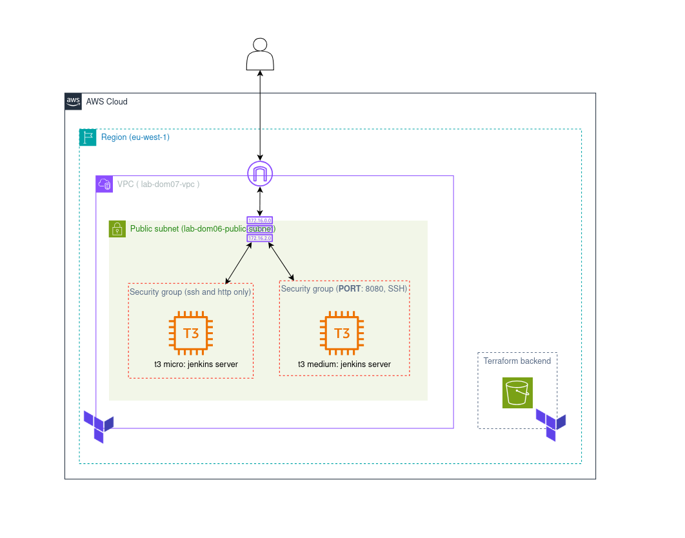
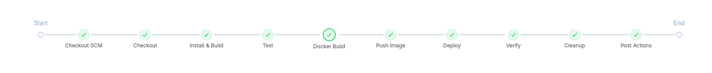
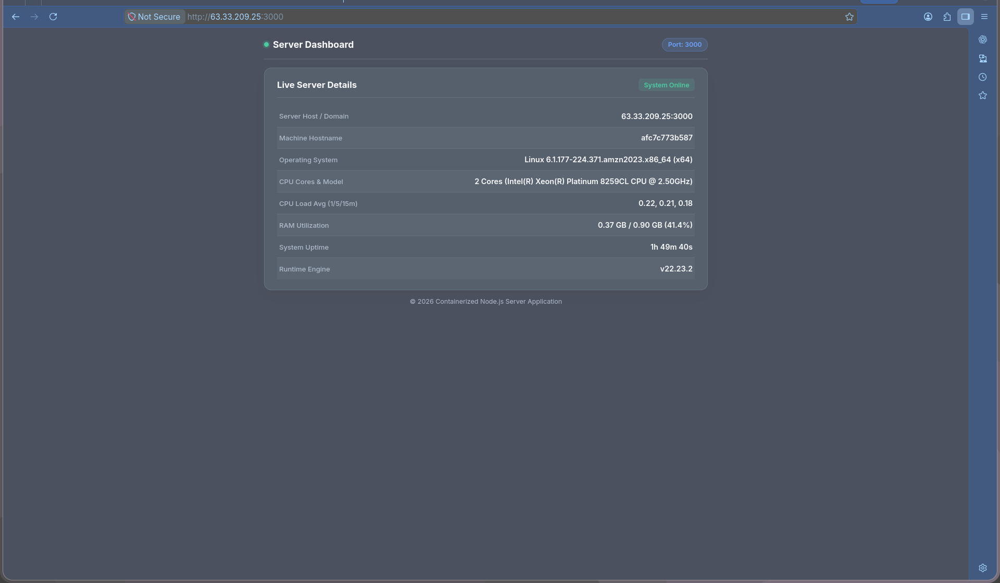
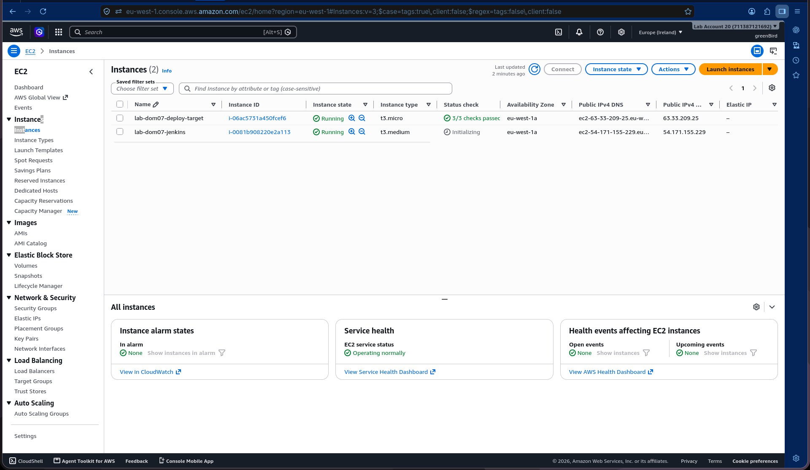
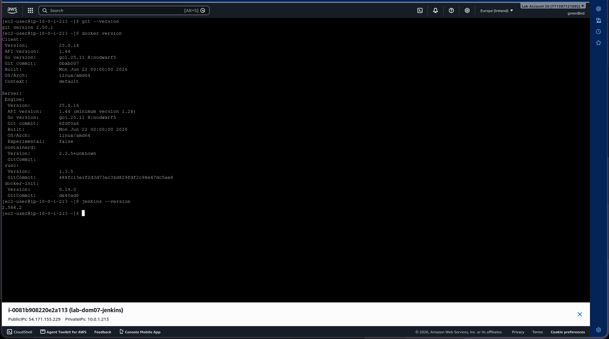
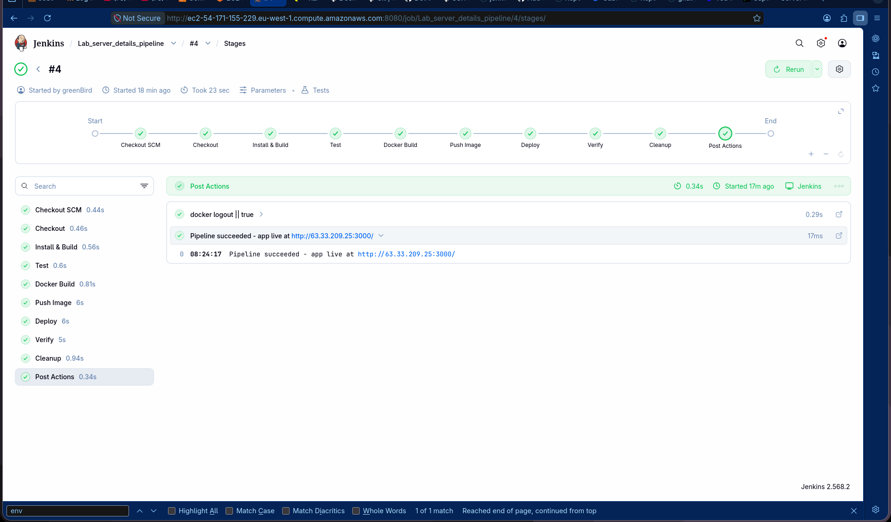

# lab-dom07-cicd

Terraform-provisioned infrastructure for a Jenkins CI/CD pipeline: a Jenkins host and a separate EC2 deploy target, on Amazon Linux 2023. The pipeline itself (Jenkinsfile, app, tests, Dockerfile) lives in [Ghaby-X/server_details](https://github.com/Ghaby-X/server_details) - a standalone repo, built independently of this monorepo.

## Architecture

Two EC2 instances in one VPC/public subnet:

- **Jenkins host** (`t3.medium`) - Jenkins LTS, Docker, and Node.js installed directly on the host (no containers). Runs the pipeline: install/test happen natively, `docker build`/`push`/deploy shell out to the host's own Docker.
- **Deploy target** (`t3.micro`) - Docker only. Runs the app container the pipeline deploys.

Security groups:
- Jenkins SG: SSH (22) and the Jenkins web UI (8080), both restricted to `ssh_allowed_cidr` / `jenkins_ui_allowed_cidr`.
- Deploy SG: SSH (22) from `ssh_allowed_cidr` **and** from the Jenkins SG directly (so the pipeline's Deploy stage can always reach it, regardless of your own IP), plus the app port (3000) open to `app_allowed_cidr` for verifying accessibility.



## Structure

```
lab-dom07-cicd/
└── infrastructure/
    ├── providers.tf              AWS provider, S3 backend
    ├── variable.tf
    ├── data.tf                    AMI lookup + shared key pair remote state
    ├── networking.tf               VPC, subnet, route table
    ├── security_groups.tf
    ├── compute.tf                  Jenkins + deploy target EC2 instances
    ├── outputs.tf
    ├── terraform.tfvars.example
    └── user_data/
        ├── jenkins_install.sh       Java, Jenkins, Node.js, Docker
        └── deploy_target_install.sh Docker only
```

## Provisioning

```bash
cd infrastructure
cp terraform.tfvars.example terraform.tfvars   # fill in your own IP
terraform init
terraform apply
```

Key pair is shared across labs (`helpers/keypair`, referenced via remote state) - no separate key to generate here.

Useful outputs after apply:

```bash
terraform output jenkins_url          # http://<jenkins-dns>:8080
terraform output deploy_public_ip     # set as the DEPLOY_HOST Global property in Jenkins
terraform output app_url              # http://<deploy-dns>:3000
terraform output ssh_user             # ec2-user
terraform output private_key_path
```

## Jenkins setup

1. SSH in and get the initial admin password:
   ```bash
   ssh -i <private_key_path> ec2-user@<jenkins_public_ip>
   sudo cat /var/lib/jenkins/secrets/initialAdminPassword
   ```
2. Open `terraform output jenkins_url` in a browser, unlock Jenkins with that password, install the suggested plugins.
3. **Plugins** (Manage Jenkins → Plugins), on top of the suggested set: Docker Pipeline, SSH Agent.
4. **Credentials** (Manage Jenkins → Credentials):

   | ID | Type | Contents |
   |---|---|---|
   | `git_credentials` | Username with password / SSH key | Only needed if the app repo is private |
   | `registry_creds` | Username with password | Docker Hub username + access token |
   | `ec2_ssh` | SSH Username with private key | Contents of the deploy target's private key (`terraform output private_key_path`) |

5. New Item → Pipeline. Under Pipeline, set Definition to "Pipeline script from SCM", SCM = Git, Repository URL = `https://github.com/Ghaby-X/server_details.git`, Script Path = `Jenkinsfile` (default).
6. **Global properties** (Manage Jenkins → System → Environment variables) - set once, applied to every build (the Jenkinsfile has no `parameters` block; it reads these directly as `$DEPLOY_HOST` / `$IMAGE_NAME`):
   - `DEPLOY_HOST` = `terraform output deploy_public_ip`
   - `IMAGE_NAME` = your Docker Hub repo, e.g. `ghaby/lab-dom07-server-details`

## Verifying a run

A successful build goes Checkout → Install & Build → Test → Docker Build → Push Image → Deploy → Verify → Cleanup:



After it completes:

```bash
curl http://<deploy_public_ip>:3000/api/server-info
```

or open `terraform output app_url` in a browser - the dashboard should show live host metrics from the deploy target.

## Cleanup

```bash
cd infrastructure
terraform destroy
```

The pipeline's own Cleanup stage prunes images/containers on the deploy target after every deploy; `terraform destroy` is for tearing down the whole lab.

## Submission evidence

Live app: **http://63.33.209.25:3000/**
App source: **https://github.com/Ghaby-X/server_details**

| | |
|---|---|
|  |  |
| App live on the deploy target | Both instances running in EC2 (Amazon Linux 2023) |
|  |  |
| `git`/`docker`/`jenkins` versions on the Jenkins host | Full green pipeline run - Checkout through Cleanup |
