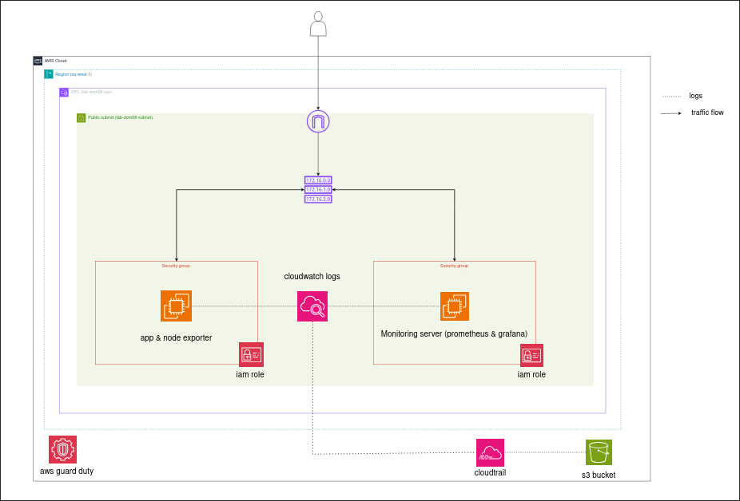
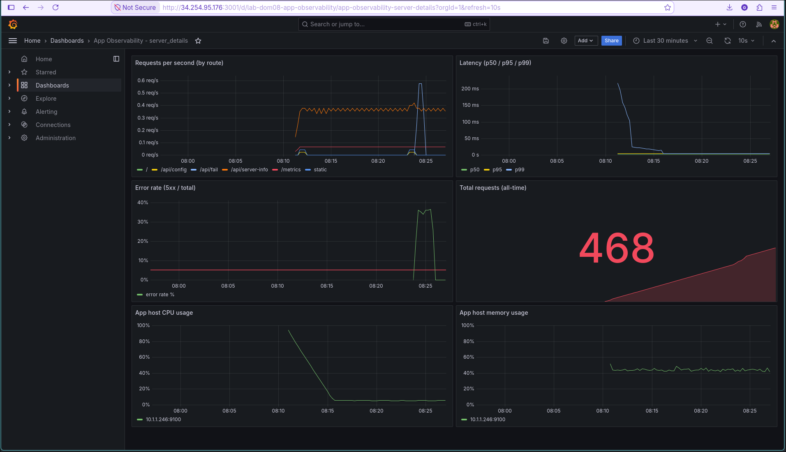
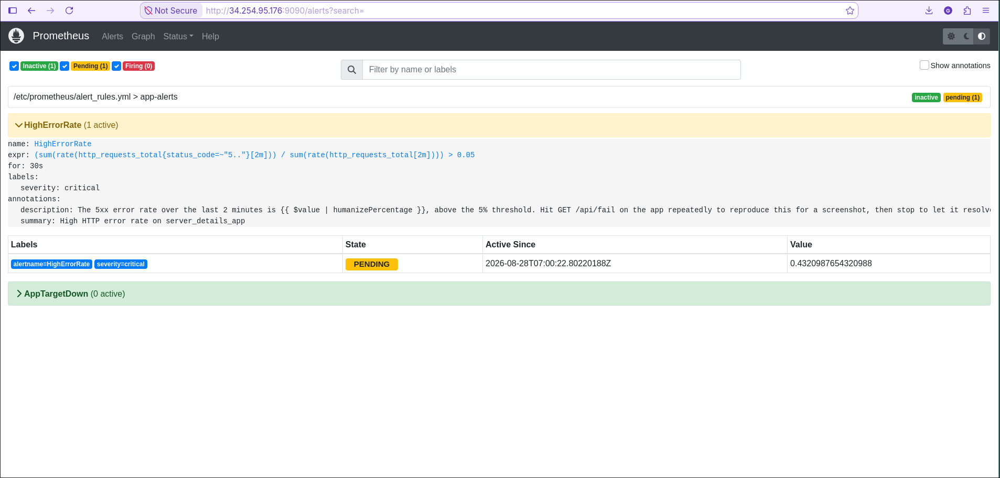
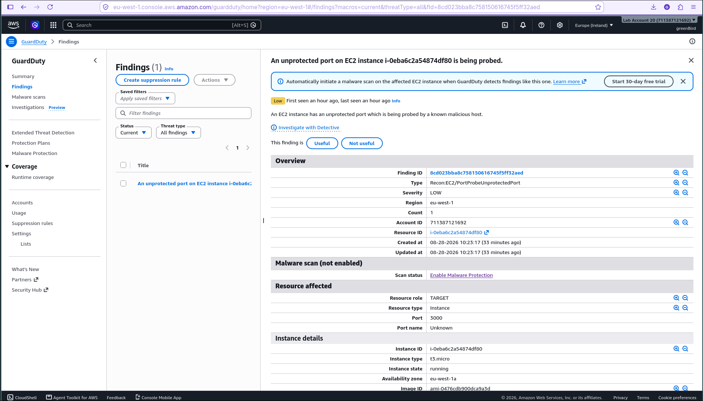
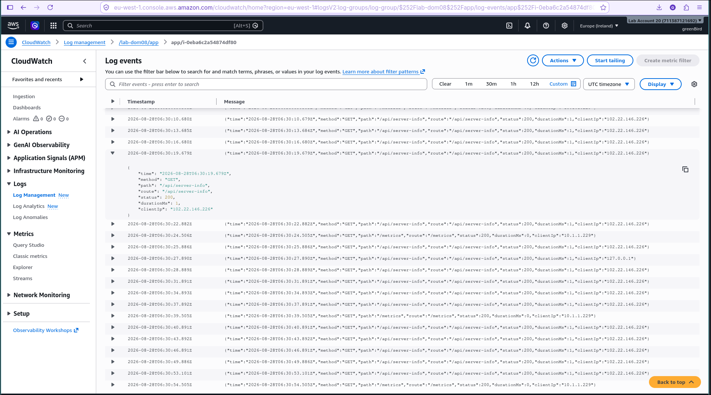
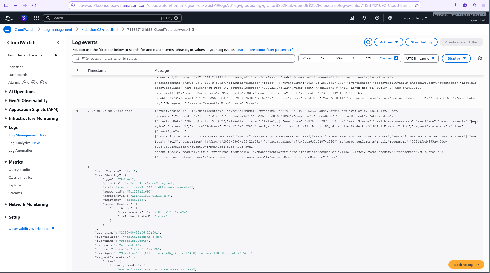

# lab-dom08-monitoring

Full observability & security stack for the `server_details` app from [lab-dom07-cicd](../lab-dom07-cicd): Prometheus + Grafana for application/host metrics and alerting, CloudWatch Logs for container logs, and CloudTrail + GuardDuty for account-level security detection.

## Architecture

Two new EC2 instances in their own VPC (independent of lab-dom07, which may already be torn down):

- **App host** (`t3.micro`) - runs the app container (built from the `feature/prometheus-metrics` branch of [server_details](https://github.com/Ghaby-X/server_details), which adds `GET /metrics`) and a Node Exporter container for host metrics. The app container's logs stream to CloudWatch Logs via the Docker `awslogs` driver.
- **Monitoring host** (`t3.small`) - runs Prometheus (scrapes the app's `/metrics` and Node Exporter over the private network) and Grafana (dashboards + alert visibility on top of Prometheus), via Docker Compose.

- **CloudTrail** - multi-region trail, log file validation on, delivering to an encrypted, lifecycled S3 bucket and to CloudWatch Logs.
- **GuardDuty** - a detector for the account/region.



SSH reaches neither instance over the internet on a personal IP: both security groups accept port 22 only from the **EC2 Instance Connect Endpoint**'s security group (CLI, tunneled) or the AWS-managed **EC2 Instance Connect** prefix list (EC2 console's Connect button). See [Provisioning](#provisioning) - no key pair, no personal CIDR to maintain either way.

## Structure

```
lab-dom08-monitoring/
├── terraform/
│   ├── providers.tf, variable.tf, data.tf     Provider, backend, inputs
│   ├── networking.tf, security_groups.tf       VPC/subnet/route table, SGs
│   ├── instance_connect.tf                      EC2 Instance Connect Endpoint
│   ├── iam.tf                                    Roles for awslogs + CloudTrail→CloudWatch
│   ├── compute.tf                                App host + monitoring host
│   ├── cloudtrail.tf                             CloudWatch log groups, S3, CloudTrail, GuardDuty
│   ├── outputs.tf
│   ├── terraform.tfvars.example
│   └── user_data/
│       ├── app_install.sh.tpl                   Clones+builds the app, runs it + node-exporter
│       └── monitoring_install.sh.tpl             Writes configs below, `docker compose up`
├── prometheus/
│   ├── prometheus.yml.tpl                        Scrape config (app host discovered live via EC2 API)
│   └── alert_rules.yml                            HighErrorRate (>5%), AppTargetDown
├── prometheus.yml                                  Rendered copy of the above, for the submission table
├── grafana/
│   ├── provisioning/datasources/datasource.yml   Prometheus datasource (auto-provisioned)
│   ├── provisioning/dashboards/dashboard.yml     Dashboard provider config
│   └── dashboards/app-observability.json          RPS, latency p50/p95/p99, error rate, host CPU/mem
├── docker-compose.monitoring.yml                  Reference copy of what runs on the monitoring host
├── architecture.png                                Architecture diagram
├── screenshots/                                    Evidence (see checklist below)
└── report/REPORT.md                                2-page insights report
```

## Provisioning

**1. Push the app's metrics branch** - Terraform's app host clones `server_details` at `feature/prometheus-metrics` (this repo's default `app_repo_ref`), which is what adds `GET /metrics` and `GET /api/fail`. That branch was committed locally in this session but not pushed. Before `apply`:

```bash
cd /path/to/server_details
git push -u origin feature/prometheus-metrics
```

(Or merge it to `main` and set `app_repo_ref = "main"` in your `terraform.tfvars`.)

**2. Apply:**

```bash
cd terraform
cp terraform.tfvars.example terraform.tfvars   # fill in your own IP for admin_allowed_cidr
terraform init
terraform apply
```

Useful outputs after apply:

```bash
terraform output app_url                 # http://<app-dns>:3000 - the dashboard
terraform output app_metrics_url         # .../metrics - raw Prometheus scrape output
terraform output app_fail_url            # .../api/fail - always-500, for the error-rate demo
terraform output prometheus_url          # http://<monitoring-dns>:9090
terraform output prometheus_alerts_url   # .../alerts
terraform output grafana_url             # http://<monitoring-dns>:3001 (admin/admin by default)
terraform output ssh_app                 # aws ec2-instance-connect ssh --instance-id ... --connection-type eice
terraform output ssh_monitoring
```

SSH needs the AWS CLI v2 and `ec2-instance-connect:SendSSHPublicKey` + `ec2-instance-connect:OpenTunnel` + `ec2:DescribeInstances` permissions (present if you're using an admin/full-access credential). Give the instances 2-3 minutes after `apply` for user-data to finish building the app image and pulling the Prometheus/Grafana images.

## Verifying it's working

### Dashboards

1. Open `terraform output grafana_url`, log in `admin`/`admin` (change it when prompted).
2. The **App Observability - server_details** dashboard is already provisioned (Dashboards → browse). It should show live panels: Requests per second, Latency p50/p95/p99, Error rate, Total requests, App host CPU/memory.
3. Generate some traffic so the panels have data:

   ```bash
   APP_URL=$(cd terraform && terraform output -raw app_url)
   for i in $(seq 1 200); do curl -s "$APP_URL/" -o /dev/null; curl -s "$APP_URL/api/server-info" -o /dev/null; sleep 0.2; done
   ```

### Error-rate alert (>5%)

The `HighErrorRate` rule (`prometheus/alert_rules.yml`) fires when 5xx responses exceed 5% of traffic over a 2-minute window, `for: 30s`. `GET /api/fail` always returns 500 - drive a mix of success and failure traffic to cross the threshold:

```bash
APP_URL=$(cd terraform && terraform output -raw app_url)
for i in $(seq 1 100); do
  curl -s "$APP_URL/" -o /dev/null
  curl -s "$APP_URL/api/fail" -o /dev/null   # ~50% error rate, well above 5%
  sleep 0.5
done
```

Then check:

- Prometheus → `terraform output prometheus_alerts_url` - `HighErrorRate` should be **Firing** (Pending → Firing after the 30s `for`).
- Grafana → Alerting → Alert rules - the same Prometheus-native rule is listed there too (the datasource has `manageAlerts: true`), plus the dashboard's Error rate panel crossing its red threshold line.

Stop the loop and give it a few minutes to drop back under 5% to see it resolve.

### CloudWatch Logs

```bash
aws logs tail /lab-dom08/app --follow
```

You should see the app container's stdout (`Server details app listening on http://0.0.0.0:3000`, etc.) - confirms the `awslogs` Docker log driver is working. Also check the AWS Console → CloudWatch → Log groups → `/lab-dom08/app`.

### CloudTrail

Console → CloudTrail → Trails → `lab-dom08-trail` should show **Logging: On**. Console → CloudTrail → Event history shows recent account activity (e.g. this very `terraform apply`). Check the S3 bucket (`terraform output cloudtrail_bucket`) for delivered log files under `AWSLogs/<account-id>/CloudTrail/...`, and its **Properties** tab for encryption (SSE-S3/AES256) and the lifecycle rule.

### GuardDuty

Console → GuardDuty → Findings. A fresh detector often has no findings for a while (it needs real signal, e.g. VPC Flow Logs / DNS logs / CloudTrail events indicative of something worth flagging). To generate a benign sample finding for a screenshot: GuardDuty → Settings → Sample findings → **Generate sample findings**.

## Cleanup

```bash
cd terraform
terraform destroy
```

This tears down both EC2 instances, the VPC, the Instance Connect Endpoint, the CloudTrail trail, the CloudWatch log groups, and (if `enable_guardduty = true`) the GuardDuty detector. **The S3 bucket holding CloudTrail logs is not force-deleted by `destroy`** if it still has objects in it (no `force_destroy` is set, deliberately, so a real trail's history isn't silently lost) - empty it manually first if you want it gone too:

```bash
aws s3 rm s3://$(terraform output -raw cloudtrail_bucket) --recursive
terraform destroy
```

## Screenshot checklist

Saved in `screenshots/`, matching the submission requirements table:

| Filename | Shows | Status |
| --- | --- | --- |
| `prometheus targets.png` | Prometheus → Status → Targets - `server_details_app`, `node_exporter`, and `prometheus` all **UP** | ✅ |
| `grafana_dashboard.png` | Grafana dashboard, all 6 panels live with real traffic | ✅ |
| `prometheus_high_error_rate_alert.png` | Prometheus → Alerts, `HighErrorRate` **Firing** at `0.811` (81.1%) against the 5% threshold | ✅ |
| `cloudwatch_logs_server_details.png` | CloudWatch → `/lab-dom08/app` - structured JSON per-request logs | ✅ |
| `cloudwatch_logs_cloudtrail.png` | CloudWatch → `/lab-dom08/cloudtrail` - real CloudTrail management events | ✅ |
| `guardduty_unprotected_port_3000_findings.png` | GuardDuty → Findings - organic `Recon:EC2/PortProbeUnprotectedPort` finding on port 3000 | ✅ |
| `architecture.png` | Architecture diagram | ✅ |

## Submission evidence

| | |
| --- | --- |
|  |  |
| All 3 Prometheus targets UP | Live dashboard - 468 requests captured |
|  |  |
| Alert Firing at 81.1% error rate | Organic GuardDuty finding - port 3000 probed within an hour of launch |
|  |  |
| Structured per-request JSON logs | CloudTrail management events streaming live |
