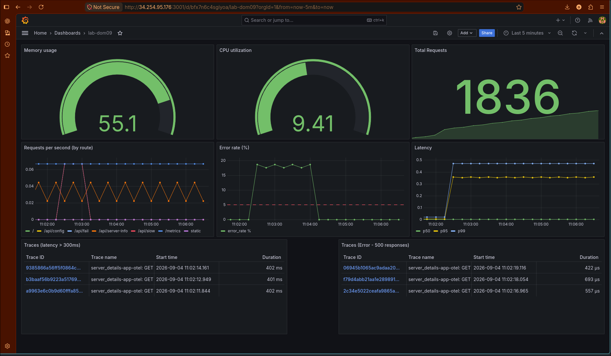
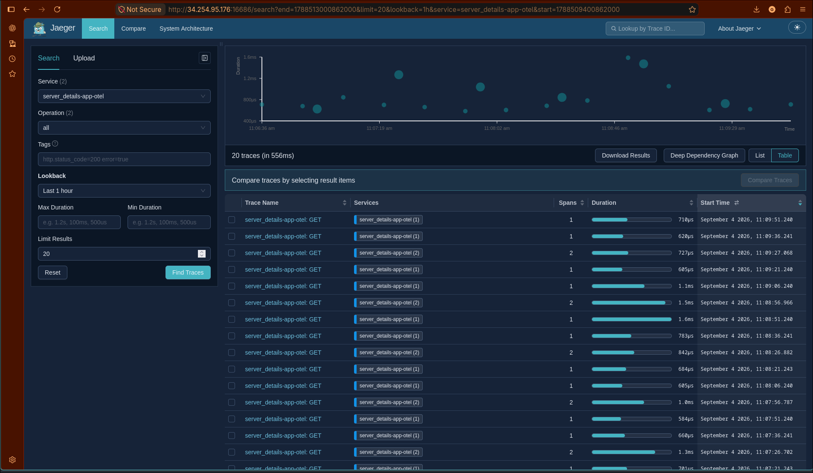
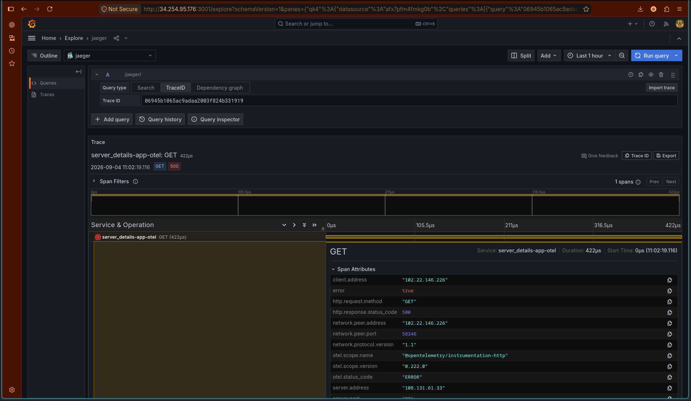
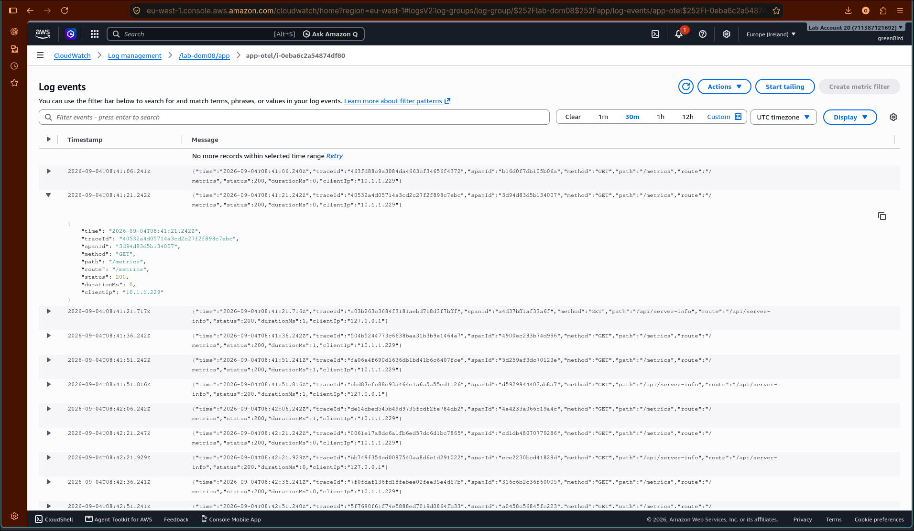
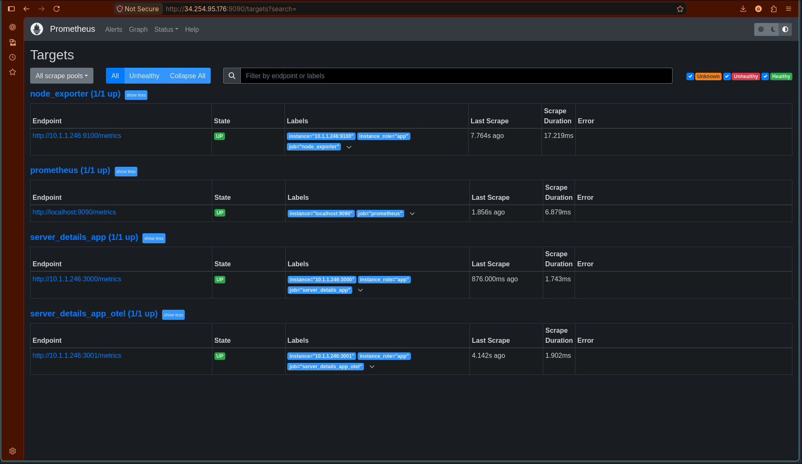
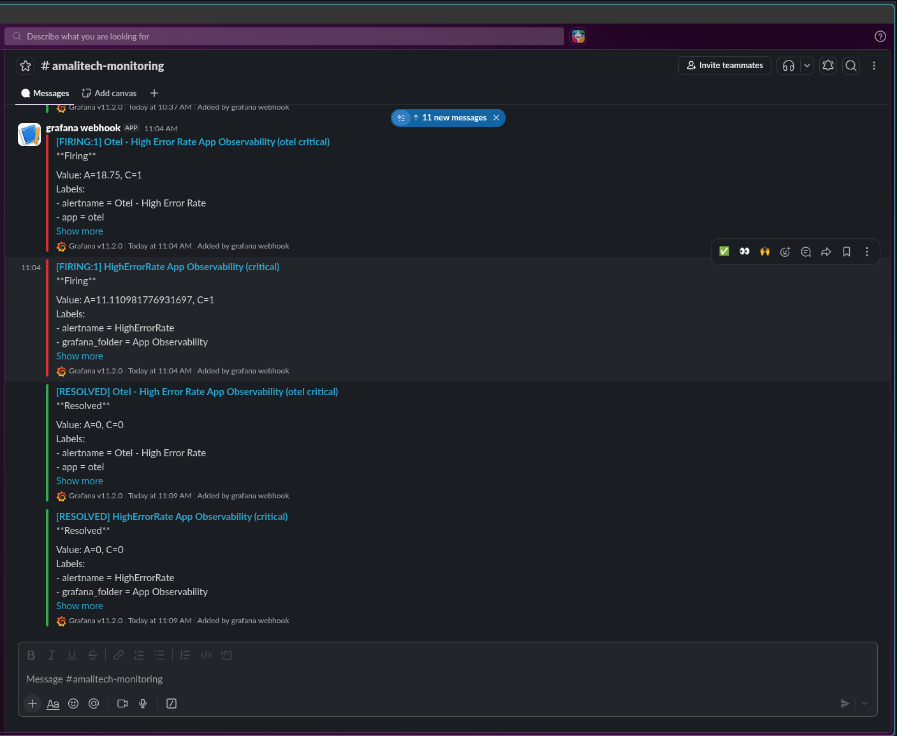
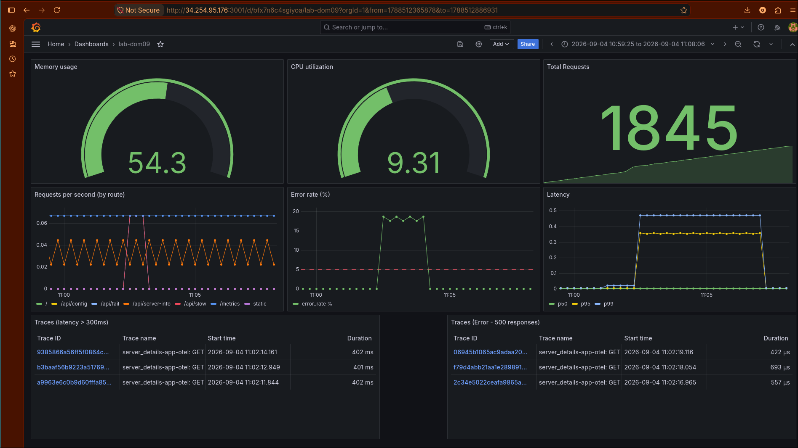
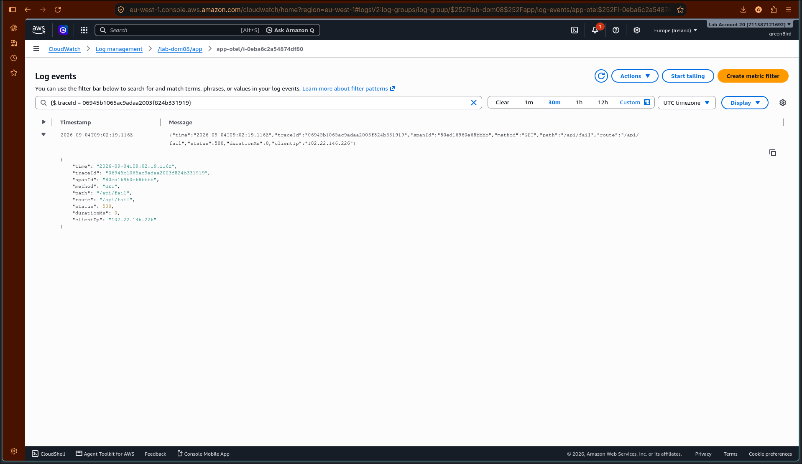
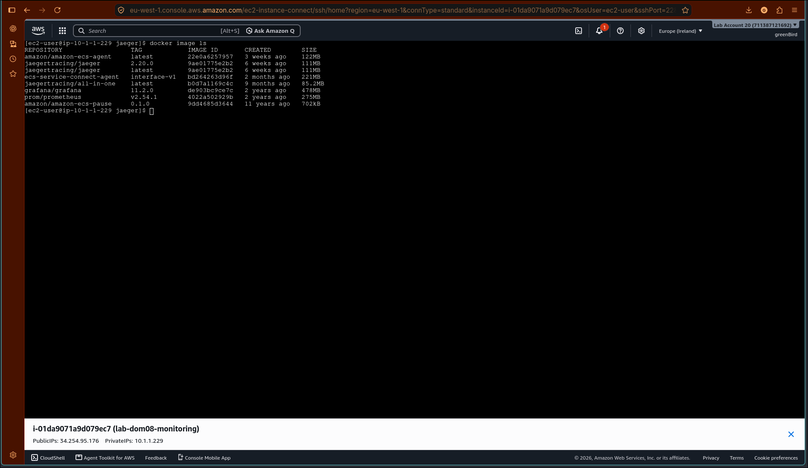
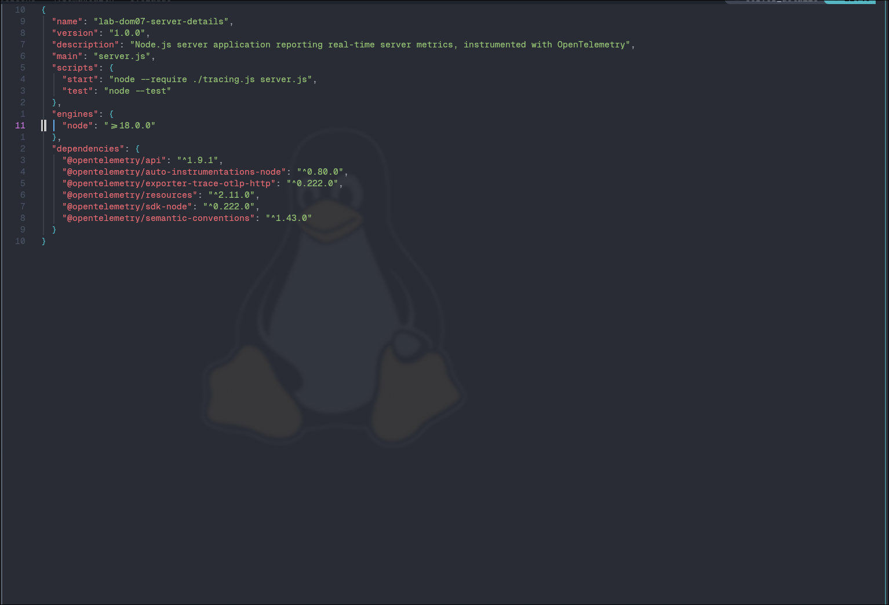

# lab-dom09-advanced-monitoring

Advanced observability & distributed tracing for the `server_details` app: OpenTelemetry instrumentation, RED metrics, Jaeger, and alert→trace→log correlation, on top of the Prometheus/Grafana/CloudWatch stack from [lab-dom08-monitoring](../lab-dom08-monitoring).

## Architecture

Extends the **already-running** `lab-dom08-monitoring` EC2 instances rather than provisioning new ones:

- **App host** - the existing `app` container (port 3000, from `feature/prometheus-metrics`) stays untouched. A second container, `app-otel` (port 3001, built from `feature/otel-tracing`), runs alongside it - OTel-instrumented, same app, different code path. Both ship structured JSON logs to the same CloudWatch log group (`/lab-dom08/app`), on separate streams.
- **Monitoring host** - the existing Prometheus and Grafana are unchanged in how they run; Prometheus gets one additional scrape job (`server_details_app_otel`, targeting port 3001) and **Jaeger v2** runs there too, as a standalone container (`jaegertracing/jaeger`, not the legacy v1 `all-in-one` image - see [implementation.md](implementation.md) §Step 2 for why).
- **Alerting** - two alerts, both confirmed firing and resolving via Slack: `HighErrorRate` (native Prometheus rule, unchanged, reused from lab-dom08 - its query has no `job` filter, so it already covered the new instrumented instance's traffic without any changes) and a new Grafana-managed alert, `Otel - High Error Rate`, scoped specifically to `app=otel`.

**Nothing in `lab-dom08-monitoring/` (git) is touched for any of this.** Every change needed on the live boxes - the SG rules, the Jaeger container, the Prometheus scrape job, the second app container - is made by hand (SSH/console), never by editing lab-dom08's terraform or committed config. Full exact commands are in [implementation.md](implementation.md).

## Structure

```
lab-dom09-advanced-monitoring/
├── README.md            This file
├── implementation.md    Detailed runbook - every command run, in order, with rationale
├── jaeger/config.yaml    Jaeger v2 config (OTLP receiver, in-memory storage, jaeger_query extension)
├── jaeger-config.yml     Flat copy of the above, for the submission deliverables list
├── screenshots/          Evidence - Jaeger traces, Prometheus targets, alert firing (Slack), log↔trace correlation
└── report/                2-page symptom → trace → root cause report
```

## App-side work

Instrumentation lives on [`server_details`](https://github.com/Ghaby-X/server_details), branch `feature/otel-tracing`: `tracing.js` (OTel SDK bootstrap), `lib/tracer.js` (shared tracer), `lib/logger.js` (trace-context-aware structured logs with `level` - `info`/`warn`/`error`, derived from the response status), the new `/api/slow` route, and `collectServerInfo()`'s manual span demonstrating automatic parent/child nesting. See that repo's own README for the app-level detail; `implementation.md` here covers how it got instrumented and why.

## Deployment

Not via `terraform apply` - see [implementation.md](implementation.md) for the full manual runbook: security group rules, the Jaeger container, the Prometheus scrape job addition, the Grafana alert rule, and the second app container, each with exact commands and a check-after-each-step.

## Verifying

Covered in detail in `implementation.md` §4: generate traffic on `/api/slow` and `/api/fail`, confirm traces in Jaeger, confirm both Prometheus app jobs stay `UP`, drive sustained `/api/fail` load to flip `HighErrorRate` Pending → Firing, and correlate a `traceId` from a live CloudWatch log line back to its matching Jaeger trace.

## Screenshot checklist

Saved in `screenshots/`:

| Filename | Shows | Status |
| --- | --- | --- |
| `grafana-dashboard.png` | RED metrics, CPU/memory, and both trace-links tables (latency>300ms, error-500) | ✅ |
| `jaeger.png` | Jaeger v2's native Search UI, traces for `server_details-app-otel` | ✅ |
| `grafana-trace.png` | A specific trace opened via Grafana Explore, showing `status_code=500` span attributes | ✅ |
| `cloudwatch-logs.png` | Structured JSON access logs in CloudWatch, `traceId`/`spanId` visible | ✅ |
| `prometheus-target.png` | All four scrape pools (`node_exporter`, `prometheus`, `server_details_app`, `server_details_app_otel`) `1/1 up` | ✅ |
| `correlation-evidence-01-alert-firing.png` | Slack, both `HighErrorRate` and `Otel - High Error Rate` firing then resolving via the Grafana webhook | ✅ |
| `correlation-evidence-02-grafana-dashboard.png` | Same trace ID, visible in the dashboard's error-traces table | ✅ |
| `correlation-evidence-03-cloudwatch.png` | Same trace ID, isolated via a CloudWatch query - full alert → trace → log chain | ✅ |
| `tools-versioning.png` | `docker image ls` on the monitoring host - `jaegertracing/jaeger 2.20.0`, `grafana/grafana 11.2.0`, `prom/prometheus v2.54.1` | ✅ |
| `opentelemetry-versioni.png` | `package.json`'s exact OTel SDK dependency versions | ✅ |

## Submission evidence

| | |
| --- | --- |
|  |  |
| RED metrics, CPU/memory, and both trace-links tables | Jaeger v2 search - traces for `server_details-app-otel` |
|  |  |
| A specific trace, opened via Grafana Explore | Structured JSON access logs, `traceId`/`spanId` visible |
|  |  |
| All four scrape pools `1/1 up` | Both alerts firing then resolving, via Slack |
|  |  |
| Same trace ID, in the dashboard's error-traces table | Same trace ID, isolated via a CloudWatch query |
|  |  |
| Jaeger/Grafana/Prometheus versions, via `docker image ls` | OTel SDK dependency versions, via `package.json` |
