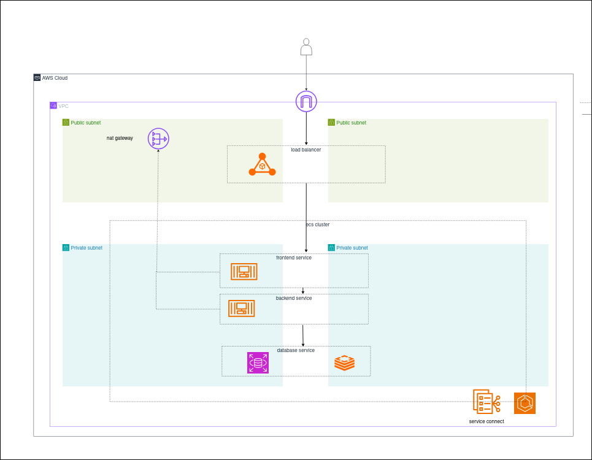
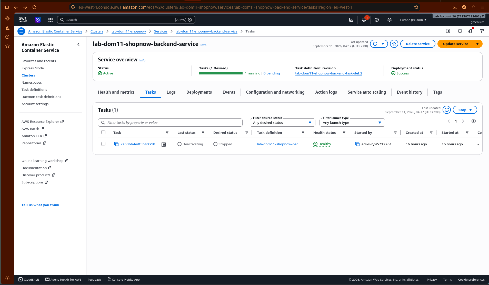
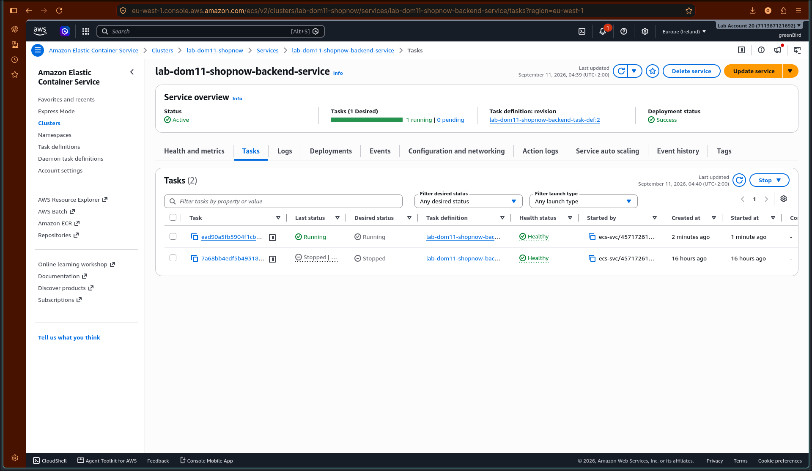

# lab-dom11-microservices: ShopNow

A four-tier e-commerce application (frontend, backend API, Redis, Postgres) deployed as independent services on Amazon ECS Fargate, provisioned with Terraform.

## Architecture



A single VPC spans two Availability Zones, with two public and two private subnets. The only public-facing component is an Application Load Balancer, which forwards HTTP traffic to the `frontend` service. `frontend`, `backend`, `postgres`, and `redis` each run as their own ECS service in the private subnets, with no direct public access. Outbound internet access from the private subnets (image pulls, log shipping) goes through a single NAT Gateway.

`frontend` and `backend` communicate over **ECS Service Connect** (`shopnow-frontend`/`shopnow-backend` aliases, proxied through an Envoy-based sidecar in each task). `backend` reaches `postgres` and `redis` over classic **ECS Service Discovery** (Cloud Map DNS: `shopnow-postgres.lab-dom11-shopnow.local`, `shopnow-redis.lab-dom11-shopnow.local`).

## Components

| Service | Tech | Port | Role |
|---|---|---|---|
| `frontend` | Flask (server-rendered) | 3000 | Public UI: product grid, cart, checkout. Calls `backend` server-side; the browser never talks to `backend` directly. |
| `backend` | Flask (JSON API) | 8000 | `/api/products`, `/api/cart`, `/api/checkout`. Talks to Postgres and Redis. |
| `postgres` | `postgres:16-alpine` | 5432 | Product catalog and orders. Data persists on an EFS-backed volume. |
| `redis` | `redis:7-alpine` | 6379 | Cart storage, keyed by a cookie-issued cart ID with a TTL. Ephemeral, no persistent volume. |

Source: `app/frontend/`, `app/backend/`.

## Infrastructure (Terraform)

Root module: `iac/environments/sandbox/`. State is stored remotely in S3 with native S3 locking (`iac/environments/sandbox/providers.tf`).

| Module | Path | Creates |
|---|---|---|
| `networking` | `iac/modules/networking` | VPC, 2 public + 2 private subnets (one pair per AZ), Internet Gateway, 1 NAT Gateway, route tables |
| `ecr` | `iac/modules/ecr` | ECR repositories for the `backend`/`frontend` images (immutable tags, lifecycle policy, scan-on-push) |
| `security` | `iac/modules/security` | Security groups for the ALB, each ECS service, and the EFS mount targets, with per-port ingress/egress rules scoped to exactly what each component needs to reach |
| `secrets` | `iac/modules/secrets` | Generated passwords (Postgres, Redis) and the frontend's session-signing key, stored as SSM `SecureString` parameters |
| `iam` | `iac/modules/iam` | The shared ECS task execution role: ECR pull, CloudWatch Logs write/create, and scoped read access to the SSM parameters above |
| `storage` | `iac/modules/storage` | EFS filesystem, mount targets (one per private subnet), and an access point scoped to Postgres's data directory |
| `ecs` | `iac/modules/ecs` | The ECS cluster, the CloudWatch log group, the Cloud Map private DNS namespace, and the Application Load Balancer (listener + target group in front of `frontend`) |

Postgres and Redis pull directly from Docker Hub; only `backend` and `frontend` have their own ECR repositories, since they're the only custom-built images.

## Task definitions and services

ECS task definitions are managed directly (not through Terraform) and live in `task-definitions/`: `lab-dom11-shopnow-{postgres,redis,backend,frontend}-task-def.json`. Each references the execution role, SSM parameters, and (for `postgres`) the EFS filesystem/access point produced by the Terraform modules above.

Each service runs on Fargate with one task, in the private subnets, using the security group scoped to that component. `postgres`'s task definition mounts the EFS volume at `/var/lib/postgresql/data`; Postgres's own `initdb` process initializes it on first boot, and later task restarts reuse the same data.

Secrets (`POSTGRES_PASSWORD`, `REDIS_PASSWORD`, `SECRET_KEY`) are injected via each container definition's `secrets` block, referencing the SSM parameters by name, never as plaintext values in the task definition.

## Local development

`app/docker-compose.yml` runs all four services locally, using the same images as production. Each service's configuration lives in its own env file (`postgres.env`, `redis.env`, `backend.env`, `frontend.env`), and ports are bound to `127.0.0.1` only.

```bash
cd app
docker compose up -d --build
```

Redis requires authentication locally too (`--requirepass`, matching the deployed configuration), and Postgres's healthcheck/`depends_on` chain ensures `backend` doesn't start until both are ready.

## Resiliency

ECS's service scheduler maintains each service's desired task count automatically. Stopping a running task directly (bypassing any graceful shutdown) triggers ECS to launch a replacement without manual intervention:

| | |
|---|---|
|  |  |
| The running task is manually stopped | ECS immediately starts a replacement task |
|  | |
| The replacement reaches a healthy state, service returns to steady state | |

## Repository structure

```
lab-dom11-microservices/
├── app/
│   ├── frontend/            Flask UI (templates, static assets, app.py)
│   ├── backend/              Flask API (routes/, db.py, cache.py)
│   ├── docker-compose.yml    Local four-service stack
│   └── *.env                 Per-service local configuration
├── iac/
│   ├── environments/sandbox/  Root Terraform module
│   └── modules/                 networking, ecr, security, secrets, iam, storage, ecs
├── task-definitions/          ECS task definition JSON, one per service
├── screenshots/                 Resiliency evidence
└── ecs_architecture.png         Architecture diagram
```
