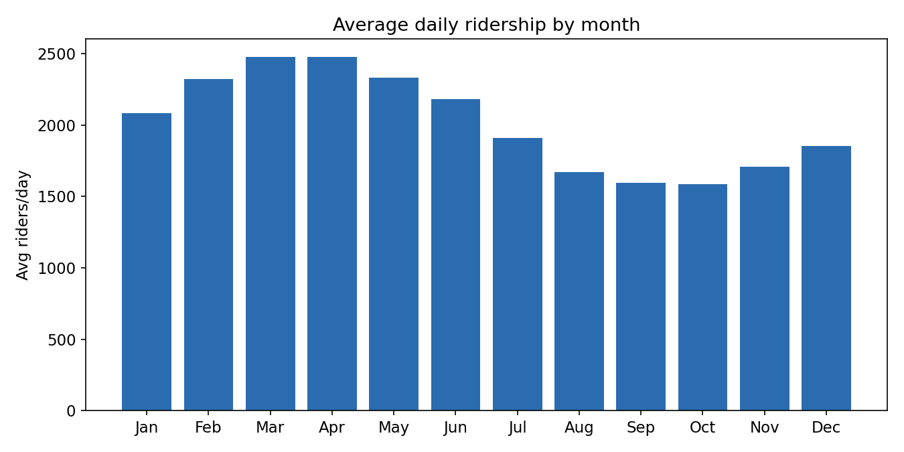
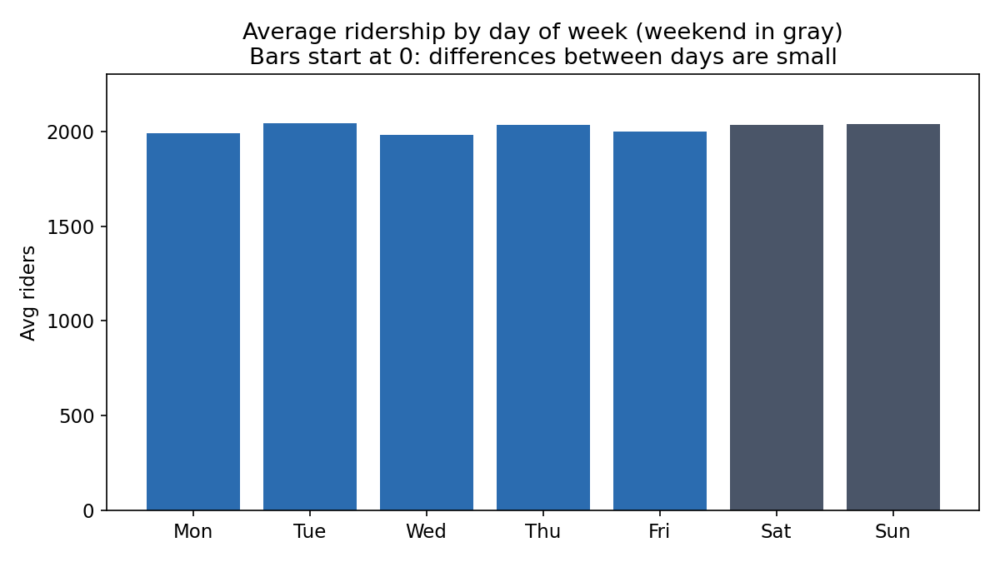
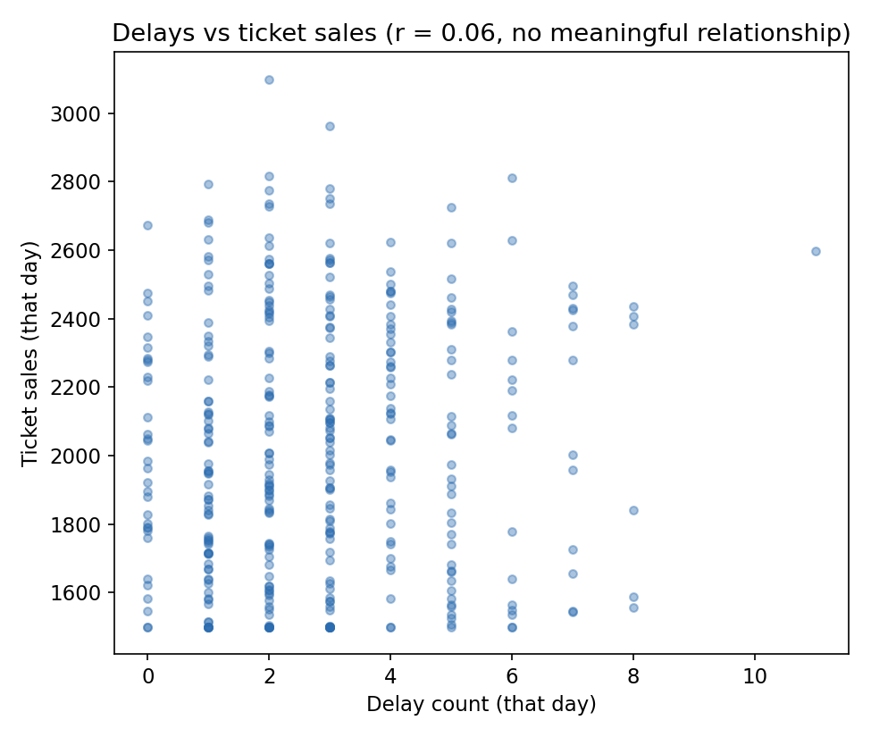
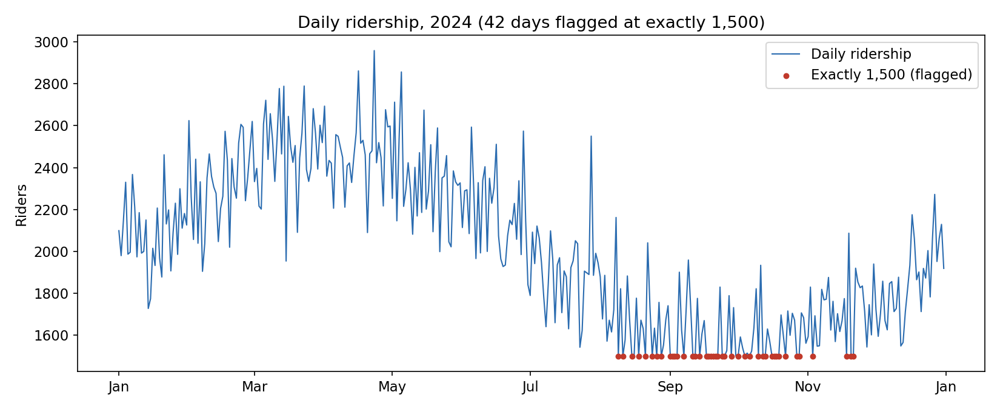

# UrbanTransit 2024 Ridership Insights Report

Prepared for the operations team. Covers daily ridership, ticket sales,
and delays for all of 2024 (366 days, January 1 through December 31).

## Executive summary

Ridership follows a clear seasonal pattern, spring is the busiest time
of year and late summer/early fall is the quietest, but a chunk of the
autumn data looks like a reporting glitch rather than real ridership,
and should be treated with caution until it's confirmed. Delays do not
appear to be driving ticket sales down. The day of the week barely
matters. Full detail below.

## Key trends

### Ridership rises and falls with the seasons

Average daily ridership by month:

Spring (March and April) is the peak, averaging about 2,480 riders a
day. Ridership then declines through summer, bottoming out in
September and October at roughly 1,590-1,600 riders a day, about 36%
lower than the spring peak (equivalently, the spring peak is about 56%
higher than the autumn trough), before recovering into winter. This is
a real, consistent pattern across the whole season, not a couple of odd
days.

### Day of the week barely matters

Every day of the week averages within about 3% of every other day.
Tuesday is technically the highest and Wednesday the lowest, but that
gap is small compared to how much ridership normally bounces around
day to day, so it isn't a pattern worth planning around. Weekday and
weekend averages are also essentially the same.

### Delays don't appear to move ridership or sales

A common assumption is that more delays mean fewer riders and less
revenue. We checked this directly, both how often delays happen and
how long they last, against both ridership and ticket sales, and found
no meaningful link in either direction. The scatter plot above shows
why: there's no visible trend, just a shapeless cloud of points. This
doesn't mean delays don't matter to riders, it means this dataset
doesn't show them affecting whether people buy tickets or ride.

## Notable anomalies

### A likely data problem in the autumn numbers

42 of the 366 days, about 1 in 9, show ridership at exactly 1,500
riders. That's an unusually specific number to hit that many times by
chance. These days are clustered between August 9 and November 21
(17 of them in September alone), and ticket sales on those same days
are also stuck near 1,500. Critically, the days right before and after
each flagged day jump back up to normal, noisy values instead of
declining smoothly, which is what you'd expect from a real seasonal
dip. That pattern looks like a data collection floor or a placeholder
value, not 42 genuinely identical days of ridership. The real autumn
decline is likely smaller than the raw numbers suggest.

### A handful of days where sales and ridership disagree

Ticket sales and ridership normally track each other almost exactly.
Six days break that pattern by more than about 120 people either way:
February 1, February 17, February 24, March 5, March 30, and April 23.
There's no obvious shared cause (they're not all month-end, or all the
same day of week), so these are worth a manual spot-check rather than
a policy change.

### Delays run longer, not more often, in two stretches of the year

Average delay length roughly doubles in April-June and again in
September-October compared to the rest of the year, even though how
often delays happen doesn't rise by nearly as much in those same
months. Long delays are likely more noticeable to riders than frequent
short ones, so this is worth investigating even though it didn't show
up as a ridership or sales effect above.

## Actionable recommendations

1. **Verify the Aug 9-Nov 21 ridership data before using it.** 42 days
   in that window are flagged as a likely reporting artifact, not real
   ridership. Ask whoever owns the data pipeline to check that period
   specifically before it's used to justify any service changes.
2. **Plan capacity and staffing around the season, not the day of
   week.** Spring runs about 56% higher than the autumn trough. Day-of-
   week and weekday/weekend differences are too small to be worth
   scheduling around.
3. **Don't expect on-time-performance improvements to boost ridership
   or revenue by themselves.** This data shows no measurable link
   between delays and ticket sales. If punctuality work is a priority,
   justify it on rider experience, not as a revenue lever.
4. **Look into what's causing longer (not more frequent) delays in
   April-June and September-October.** The consistency across two
   separate stretches of the year suggests a real operational cause
   (maintenance schedule, weather, staffing) worth investigating.
5. **Spot-check the six flagged sales/ridership mismatch days** before
   they feed into any revenue reporting, to rule out a data-entry
   issue.

## Prompt History

Every prompt used to reach these findings, including the first-pass
answers that turned out to be wrong and had to be corrected against the
real numbers, is logged in
[`prompt-history.md`](prompt-history.md). In short: ran the lab's four
suggested starter prompts first, got a plausible-sounding but partly
unsupported answer on both the "peak day" question and the delay/sales
relationship, then re-ran both against the actual computed statistics
(day-of-week averages, Pearson correlation) and corrected the findings
accordingly. The anomaly section came from a follow-up prompt after
noticing the repeated 1,500 values directly in the data, not from the
original four prompts. All underlying numbers are reproducible from
[`analysis/analyze.py`](analysis/analyze.py) and its output in
[`analysis/analysis_output.txt`](analysis/analysis_output.txt).

## Reflection

The biggest challenge was resisting a plausible-sounding first answer.
Asked casually, the AI confidently named a "peak day" and assumed
delays hurt ticket sales, both reasonable guesses that turned out to be
unsupported once actually computed. Neither was a wild hallucination,
they were the kind of confident, moderate claims that are easy to
accept without checking.

Accuracy came from refusing to trust any claim without a number behind
it: computing real day-of-week averages against the overall day-to-day
variation, running an actual correlation instead of reasoning about
one, and visually charting the data with an honest (zero-based) axis
rather than one that would exaggerate a small effect. The exact-value
anomaly (1,500 repeated 42 times) was found by scanning for statistical
oddities, not by asking the AI to "find anomalies" and trusting the
answer.

My prompts evolved from broad and generic ("is there a correlation?")
to specific and evidence-first ("here is the actual r-value, write one
sentence that doesn't overstate it"), which produced shorter, more
defensible, less confident-sounding output, and that was the goal.
