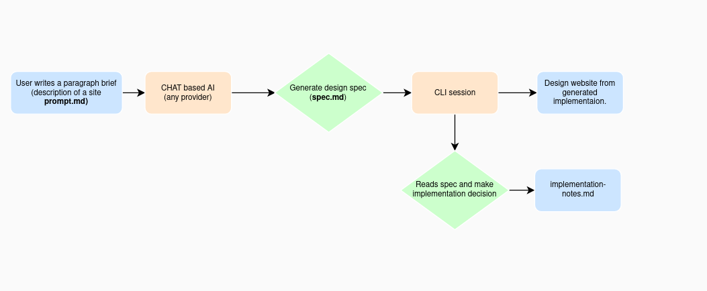
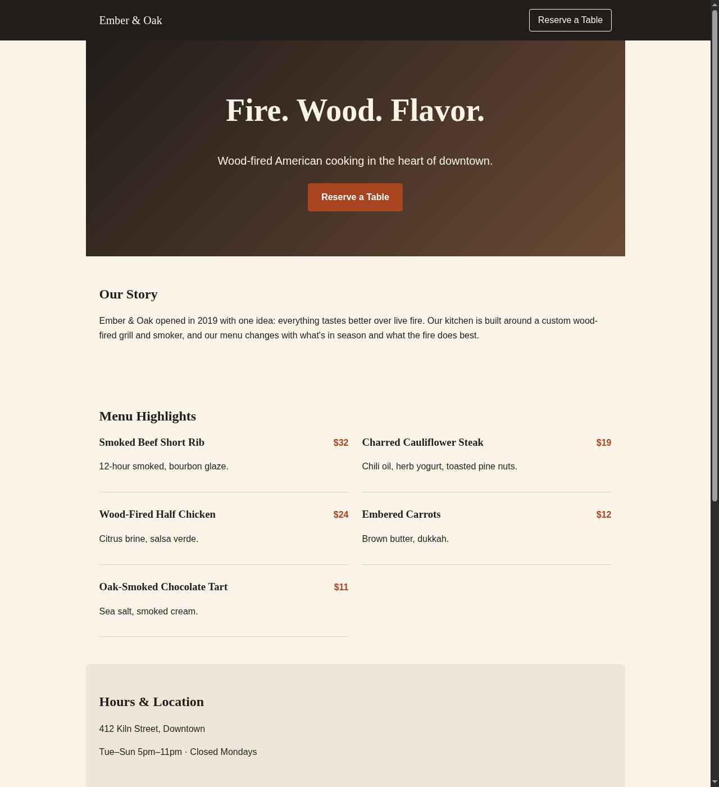
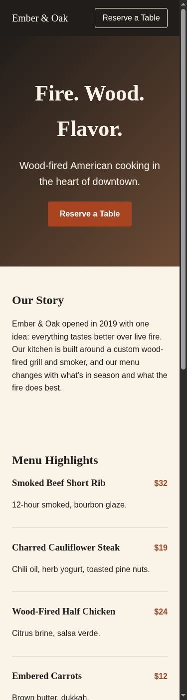

# Multi-Stage AI Workflow Across UX Types

A chat-based AI drafts a design spec for a restaurant landing page; a
CLI-based AI (Claude Code) turns that spec into a working static site.
The output of stage 1 is the literal input to stage 2: nothing is
regenerated from scratch, and nothing is hand-written outside the two AI
stages.

## Workflow diagram



## Step-by-step

1. **Brief.** The user writes one short paragraph describing what they
   want (here: "a restaurant landing page"). No design decisions yet.
2. **Chat stage.** The user pastes [`01-chat-stage/prompt.md`](01-chat-stage/prompt.md)
   into any chat-based AI. The AI invents a restaurant concept and
   returns a structured spec: copy, sections, color/type *intent*, and
   explicit out-of-scope items. Raw, unedited output is captured at
   [`01-chat-stage/spec.md`](01-chat-stage/spec.md).
3. **Handoff.** The user copies `spec.md` as-is into a CLI AI session.
   This is the only manual step in the whole workflow: copy-pasting one
   file between two tools.
4. **CLI stage.** The CLI AI reads the spec and implements it as a real,
   dependency-free static page under [`../site`](../site): `index.html`,
   `styles.css`, `script.js`. Every place the spec left a decision open
   (exact colors, font stack, how the backend-less form should behave)
   is resolved and the reasoning recorded in
   [`02-cli-stage/implementation-notes.md`](02-cli-stage/implementation-notes.md),
   so the trail from "intent" to "pixels" is auditable.
5. **Verification.** The CLI stage serves the page locally and checks it
   renders, the responsive breakpoint works, and the reservation form
   validates and confirms client-side (see below).

## Why chat → CLI specifically

- A chat AI has no code-execution or filesystem access in this setup:
  it's good at generating *content and intent* quickly, bad at producing
  something directly runnable.
- A CLI AI has filesystem access and can run/verify what it writes, but
  benefits from not having to invent the restaurant's name, copy, and
  menu from nothing. That's a content-generation task a chat tool
  front-loads well.
- Chaining them means each stage does the part it's actually good at,
  and the handoff artifact (`spec.md`) is a plain Markdown file, not an
  API call or plugin, so the two stages never need to know about each
  other.

## Adaptability

Nothing here is tied to a specific vendor:

- Stage 1 only assumes a chat AI that can follow instructions and
  produce Markdown: ChatGPT, Gemini Chat, Claude.ai, or any local model
  all work unmodified.
- Stage 2 only assumes a CLI AI with file read/write access: Claude
  Code, Gemini CLI, Aider, etc.
- The handoff format (a Markdown spec) has no vendor-specific structure,
  so swapping either tool requires no changes to the other stage.

## Efficiency

Writing a landing page from scratch means doing copywriting, visual
design, and implementation as one undifferentiated task. Splitting it
across two AI stages means:

- Copy and content structure (the part that benefits from broad,
  fast, low-precision generation) comes from the chat stage in one
  prompt round-trip.
- Implementation (the part that benefits from being checked, not just
  generated) comes from the CLI stage, which can actually run what it
  writes instead of describing what it would write.
- The one manual step is a copy-paste, not a rewrite.

## Verification log

Run from this lab's root:

```bash
cd site
python3 -m http.server 8000
# then open http://localhost:8000 in a browser
```

Checked:
- [x] Page loads with no console errors.
- [x] All five menu items render with name, description, and price.
- [x] Layout goes to a two-column menu grid above the 640px breakpoint
      and stays single-column below it.
- [x] Reservation form rejects submission with empty/invalid fields
      (native browser validation) and shows a confirmation message on a
      valid submit, without a network request.
- [x] Nav and hero "Reserve a Table" links both scroll to the form.

### Rendered output

| Desktop | Mobile |
|---|---|
|  |  |
