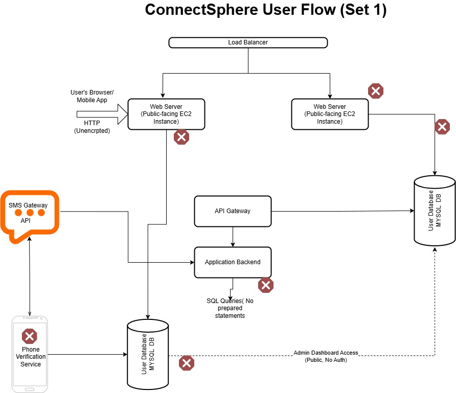
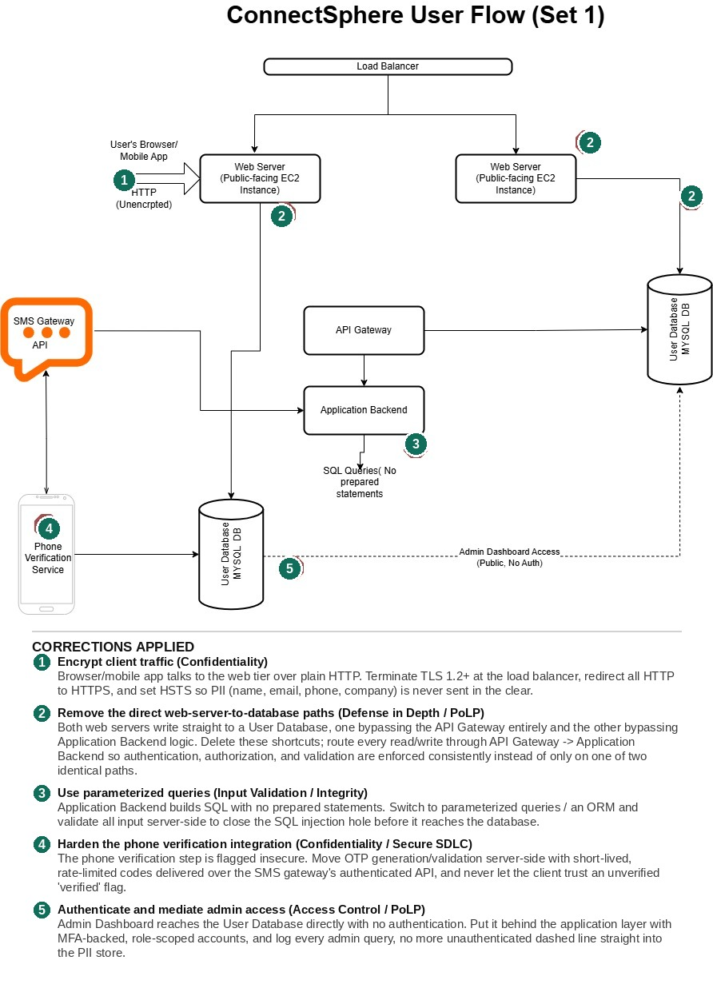

# Capstone: Prioritized Risk Analysis for ConnectSphere (Set 1)

**Assignment:** ConnectSphere – Professional Event Networking MVP (profiles, event registration, in-app messaging). Reviewed as an independent cybersecurity governance consultant against the [Set 1 user-flow architecture](images/connectsphere-userflow-set1-original.jpg).

## Deliverable 1: Cybersecurity Governance Review Card

| Section | Issue / Definition | Impact | Suggested Fix / Mitigation |
|---|---|---|---|
| **1. Confidentiality Risk** | PII (name, email, phone, company, title) travels from the client over plain HTTP, and both web servers hold undocumented lines straight into a User Database that skip the API Gateway entirely. This is a **CIA Triad (Confidentiality)** and **Principle of Least Privilege** failure at once: data is unencrypted in transit, and two components have DB access far beyond what their role requires. | Anyone on the network path (public Wi-Fi, ISP, MITM) can read profile PII in plaintext. The direct-to-DB paths mean that even if the API Gateway later gets stronger authorization or logging, one web server keeps bypassing it silently, so the leak point survives a partial fix. | Terminate TLS 1.2+ at the load balancer, redirect all HTTP to HTTPS, and enable HSTS. Delete both direct web-server-to-database connections; route every read/write through API Gateway → Application Backend so one authorization and logging path applies everywhere. |
| **2. Integrity Risk** | The Application Backend issues SQL queries with no prepared statements, a direct violation of **Input Validation** practice under Secure SDLC. | Any user-controlled field (profile bio, event registration form) becomes an SQL injection vector, letting an attacker read, modify, or delete records in the User Database and undermining data integrity for every profile and registration stored. | Refactor all database access to parameterized queries or an ORM, add server-side input validation/allow-listing on every form field, and gate merges behind a SAST scan as a Secure-SDLC checkpoint. |
| **3. Availability Risk** | The Admin Dashboard is reachable publicly with **no authentication**, wired directly to the User Database, and nothing in the diagram throttles the phone-verification/SMS Gateway path. This breaks **Access Control** (no PoLP boundary at all) and leaves no rate-limiting safety net. | An unauthenticated visitor who finds the admin URL can drop tables or lock rows outright, taking the platform down with zero barrier. Unthrottled SMS/OTP requests are a cheap way to exhaust the SMS budget or degrade the verification service for everyone. | Put the Admin Dashboard behind MFA-backed, role-scoped accounts on a VPN/IP allowlist, never a direct line to the database. Add rate limiting to the phone-verification/SMS endpoints and connection pooling/circuit breakers plus automated backups on the database tier. |
| **4. Monitoring / Reporting Recommendation** | **Metric:** *Unauthorized Data-Access Attempts per Hour*: count of requests hitting the Admin Dashboard or either direct-to-DB path without a valid authenticated session, plotted alongside the failed-attempt rate on phone verification. | **Visualization:** Line chart (time series) with a baseline band; an alert fires when the count crosses the band. | **Why it matters:** It watches the exact two bypass paths this review flagged, in near-real time, giving the lead time GDPR's 72-hour breach-notification clock demands instead of finding out after the fact, and it gives the CTO a number she can show investors' auditors, not just a claim that "it's fixed." |

## Deliverable 2: Corrected Architecture Diagram

**Original (flagged by internal audit):**

**Annotated with corrections:**

Five numbered corrections (three required, two extra since the diagram carried more than three distinct issues worth flagging):

1. **Encrypt client traffic**: the browser-to-web-tier hop runs over plain HTTP; enforced TLS 1.2+/HSTS closes it.
2. **Remove the direct web-server-to-database paths**: both web servers had a shortcut straight into a User Database, one skipping the API Gateway, the other skipping the Application Backend; both are deleted so every access goes through the mediated path.
3. **Parameterize the SQL layer**: no prepared statements on the Application Backend's queries; switching to parameterized queries closes the injection hole.
4. **Harden phone verification**: the verification integration is flagged insecure; OTP generation/validation moves server-side with short-lived, rate-limited codes.
5. **Authenticate admin access**: the Admin Dashboard had an unauthenticated dashed line straight into the database; it now sits behind MFA and role-scoped accounts, with every query logged.

## Deliverable 3: Summary of Review Process

My review started from the CIA Triad and walked the Set 1 diagram edge by edge rather than box by box, since most of ConnectSphere's risk here lives on the connections, not the components. Confidentiality: PII travels over plain HTTP from the client, and I traced two separate lines where a web server writes to the User Database directly, bypassing the API Gateway, a Principle of Least Privilege violation, since neither path needs, or should have, that level of access. Integrity: unparameterized SQL queries in the Application Backend leave every write path open to injection, a textbook Secure SDLC input-validation gap I'd flag in a code review, not just an architecture one. Availability: the unauthenticated Admin Dashboard sitting directly on the database is as much an availability risk as a confidentiality one: anyone who finds it can drop data or lock the service, not just read it.

Fixing these closes real compliance gaps under GDPR/CCPA: encrypting PII in transit and mediating all database access satisfies the "appropriate technical measures" language both regimes expect, and removing the unauthenticated admin path addresses the access-control safeguards regulators specifically look for during due diligence.

The monitoring metric I proposed, unauthorized access attempts against the Admin Dashboard and the direct-DB endpoints, matters ethically as much as technically: it turns "we fixed it" into something a board or auditor can verify over time, rather than a one-time claim made in a report. Transparent governance means the controls stay visible and measurable after the review ends, not just at the moment someone happened to be looking.
