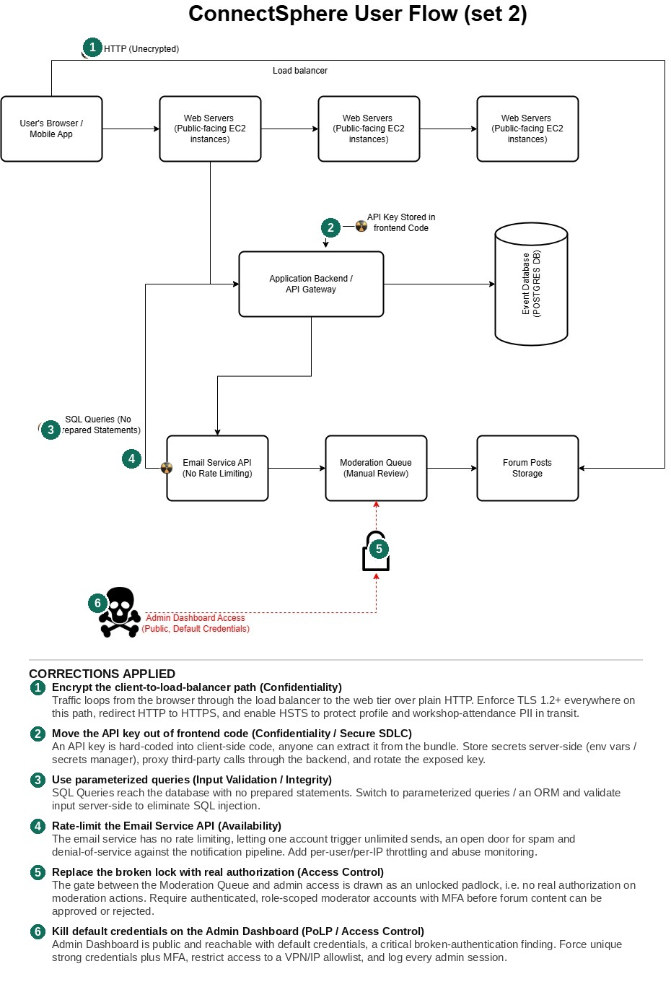

# Capstone: Prioritized Risk Analysis for ConnectSphere (Set 2)

**Assignment:** ConnectSphere – Professional Connection Platform V1 (profiles with skills/LinkedIn URL, workshop discovery/RSVP, moderated forums, planned "contact request" feature). Reviewed as an independent cybersecurity governance consultant against the [Set 2 user-flow architecture](images/connectsphere-userflow-set2-original.jpg).

## Deliverable 1: Cybersecurity Governance Review Card

| Section | Issue / Definition | Impact | Suggested Fix / Mitigation |
|---|---|---|---|
| **1. Confidentiality Risk** | Client traffic loops through the load balancer over plain HTTP, and a third-party **API key is hard-coded into frontend code**. Both break **CIA Triad (Confidentiality)**: one leaves data unencrypted in transit, the other ships a secret to every browser that loads the page, a Secure SDLC secrets-management failure as much as a network one. | Profile data (employer, title, skills, LinkedIn URL) and forum content are readable to anyone on the network path. The exposed key can be lifted straight out of the shipped bundle and reused to impersonate the app against whatever service it authorizes, a supply-chain-adjacent exposure this diagram carries that Set 1's doesn't. | Enforce TLS 1.2+/HSTS on every hop from client to load balancer to web tier. Move the key server-side into a secrets manager, proxy the third-party call through the backend instead of the client, and rotate the leaked key immediately. |
| **2. Integrity Risk** | SQL queries reach the database with no prepared statements, and the authorization gate in front of the Moderation Queue is drawn as an **open padlock**: no real check enforces it. This is an **Input Validation** failure paired with a broken **Access Control** boundary on the platform's core value proposition. | SQL injection can alter workshop attendance or forum records directly. Separately, because nothing is actually gating the Moderation Queue, forged or unreviewed posts could reach Forum Posts Storage without ever passing manual review, directly undermining the "curated, secure, spam-free" promise the platform is sold on. | Parameterize all queries / move to an ORM with server-side validation. Replace the open padlock with real RBAC: MFA-backed moderator accounts required before any post is approved into storage. |
| **3. Availability Risk** | The Email Service API has **no rate limiting**, and the Admin Dashboard is public with **default credentials**: an **Access Control / PoLP** failure severe enough to double as an availability one. | An attacker (or a bug) can flood the Email Service API and exhaust send quotas or get the sending domain blacklisted, breaking the workshop/event notifications the business explicitly promises "consistent availability" for. Default admin credentials mean anyone who tries the obvious password can disable the platform or drop its database outright. | Add per-user/per-IP throttling and provider-level abuse alerts on the Email Service API. Eliminate default credentials from provisioning, and require unique strong passwords plus MFA and IP/VPN allowlisting on the Admin Dashboard. |
| **4. Monitoring / Reporting Recommendation** | **Metric:** *Moderation Bypass Rate*: the share of forum posts reaching Forum Posts Storage without a completed Moderation Queue review record, tracked alongside failed Admin Dashboard login attempts by source IP. | **Visualization:** Bar chart of daily bypass rate, paired with a small heatmap of admin-login attempts by hour and source IP. | **Why it matters:** It measures whether the platform's stated user-facing promise, that content is moderated, is actually being kept end-to-end, not just whether a server is up; the login heatmap gives early warning of default-credential brute-forcing. That link between a technical control and a business promise is what makes it a governance metric investors can trust, not just an ops dashboard. |

## Deliverable 2: Corrected Architecture Diagram

**Original (flagged by internal audit):**

**Annotated with corrections:**

Six numbered corrections (three required, extended to six since the diagram carried more than three distinct issues worth flagging):

1. **Encrypt the client-to-load-balancer path**: the loop from browser through load balancer to the web tier runs over plain HTTP; TLS 1.2+/HSTS closes it.
2. **Move the API key out of frontend code**: a hard-coded key is extractable from the client bundle; it moves server-side into a secrets manager.
3. **Parameterize the SQL layer**: queries reach the database with no prepared statements; parameterized queries/ORM close the injection path.
4. **Rate-limit the Email Service API**: no throttling exists today; per-user/IP limits and abuse monitoring stop it being used for spam or DoS.
5. **Replace the broken lock with real authorization**: the gate in front of the Moderation Queue is drawn open; MFA-backed moderator RBAC now enforces it.
6. **Kill default credentials on the Admin Dashboard**: public access with default creds is replaced with unique strong credentials, MFA, and a VPN/IP allowlist.

## Deliverable 3: Summary of Review Process

For Set 2 I again anchored the review in the CIA Triad, but the diagram's specific failure points pushed the emphasis toward integrity and availability more than a generic pass would, since this platform's whole pitch is a curated, moderated space. Confidentiality took the same HTTP-in-transit hit any unencrypted client path would, plus a second, more startup-specific failure: an API key hard-coded into frontend code, which is a Secure SDLC violation as much as a confidentiality one, since it ships a secret to every client that loads the page. Integrity concerned me most here: unparameterized SQL queries sit next to a Moderation Queue whose authorization gate is drawn as an open padlock, meaning the platform's core promise, that forum content is reviewed before publication, isn't actually enforced by anything in the architecture. Availability risk centered on the Email Service API's missing rate limit and an Admin Dashboard left on default credentials, either of which could take the platform offline right when the business goal calls for "consistent availability for events."

Correcting these directly improves ConnectSphere's compliance posture: encrypting transit and removing the exposed key address GDPR/CCPA's transmission and processor-security expectations, while enforcing real authorization on moderation and admin access satisfies the least-privilege and accountability principles auditors test for during due diligence.

The monitoring metric I recommended, the share of forum posts that reach storage without a completed moderation record, paired with an admin-login heatmap, was chosen deliberately: it measures whether a stated user-facing promise is actually being kept, not just whether a server is up. That distinction is what makes it a governance metric rather than an operations one, and reporting it openly is what lets ConnectSphere's investors trust the fix instead of just the words describing it.
